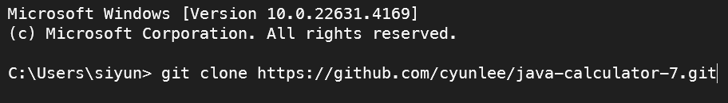

# 프리코스 1주차 미션 - 문자열 덧셈 계산기

## 미션 목표 (Objectives)

> 입력한 문자열에서 숫자를 추출하여 더하는 계산기를 구현한다.

## 시작하기 (Getting Started)



1. 저장소를 포크하고 클론한다. 
2. 클론한 폴더로 이동 후 브랜치를 생성한다. 
3. IDE에서 폴더를 열고 코드를 작성한다.

## 기능 목록 (Features)

- [ ] 계산기의 입출력 틀 구현하기
  - [ ] 사용자로부터 문자열 입력받기
  - [ ] 결과 출력하기
- [ ] 구분자를 기준으로 문자열에서 숫자를 추출하기
  - [ ] 쉼표(,) 또는 콜론(:) 구분자가 문자열에 포함되는 경우
  - [ ] 커스텀 구분자가 문자열에 포함되는 경우
  - [ ] 구분자가 없는 경우 - 빈 문자열
- [ ] 예외 처리하기 - IllegalArgumentException 발생 후 애플리케이션 종료
  - [ ] 음수를 입력한 경우
  - [ ] 숫자가 아닌 문자를 입력한 경우

## 기타 요구사항 목록 (Requirements)

- [ ] JDK 21 버전임을 확인하기
- [ ] 자바 코드 컨벤션을 지키면서 코드 구현하기
- [ ] README.md에 정리한 기능 목록을 기반으로 커밋하기
- [ ] AngularJS Git 커밋 메시지 컨벤션을 지키면서 커밋 메시지 작성하기
- [ ] 제공된 Console API를 사용하여 구현하기

### 입출력 요구 사항

#### ✍️ 입력

- 구분자와 양수로 구성된 문자열

#### 📃 출력

- 덧셈 결과

```shell
결과 : 6
```

#### 실행 결과 예시

```shell
덧셈할 문자열을 입력해 주세요.
1,2:3
결과 : 6
```

### 과제 진행 요구 사항
- 미션은 [문자열 덧셈 계산기](https://github.com/woowacourse-precourse/java-calculator-7) 저장소를 포크하고 클론하는 것으로 시작한다.
- **기능을 구현하기 전 README.md에 구현할 기능 목록을 정리**해 추가한다.
- Git의 커밋 단위는 앞 단계에서 README.md에 정리한 기능 목록 단위로 추가한다.
  - [AngularJS Git Commit Message Conventions](https://gist.github.com/stephenparish/9941e89d80e2bc58a153)을 참고해 커밋 메시지를 작성한다.
- 자세한 과제 진행 방법은 [프리코스 진행 가이드 문서](https://github.com/woowacourse/woowacourse-docs/tree/main/precourse#%EC%A0%9C%EC%B6%9C-%EA%B0%80%EC%9D%B4%EB%93%9C)를 참고한다.

### 프로그래밍 요구 사항
- JDK 21 버전에서 실행 가능해야 한다.
- 프로그래밍 실행의 시작점은 Application의 main()이다.
- build.gradle 파일은 변경할 수 없으며, **제공된 라이브러리 이외의 외부 라이브러리는 사용하지 않는다.**
  - camp.nextstep.edu.missionutils에서 제공하는 Console API를 사용하여 구현해야 한다.
    - 사용자가 입력하는 값은 camp.nextstep.edu.missionutils.Console의 readLine()을 활용한다.
- 프로그래밍 종료 시 System.exit()를 호출하지 않는다.
- 프로그래밍 요구 사항에서 달리 명시하지 않는 한 파일, 패키지 등의 이름을 바꾸거나 이동하지 않는다.
- [자바 코드 컨벤션](https://github.com/woowacourse/woowacourse-docs/tree/main/styleguide/java)을 지키면서 프로그래밍한다.

## 사용 예시 (Usage)

## 테스트 (Testing)
- 터미널에서 java -version을 실행하여 Java 버전이 21인지 확인한다.
- gradlew.bat clean test 또는 ./gradlew.bat clean test 명령을 실행할 때 모든 테스트가 아래와 같이 통과하는지 확인한다.


