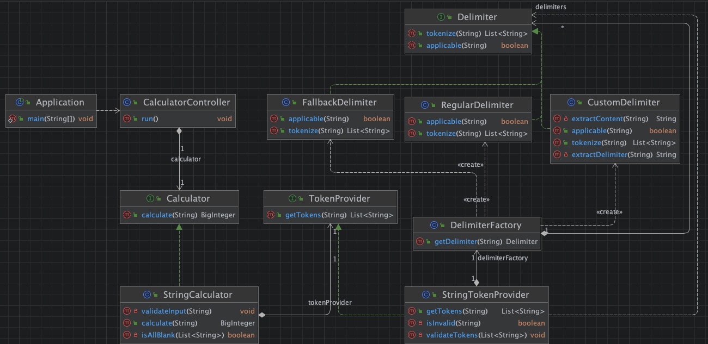

# 개요

이 애플리케이션은 문자열을 다양한 구분자로 분리하여 숫자들을 합산하는 계산기입니다.

아래는 요구사항 정리와, 어플리케이션 주요 흐름에 대한 설명입니다.

- [1. 요구사항 정리](#1-요구사항-정리)
- [2. 주요 흐름](#2-주요-흐름)

---

# 1. 요구사항 정리

## 요구사항 1 - 쉼표와 숫자가 포함된 문자열이 제공되면, 쉼표를 기준으로 숫자를 분리하여 더한 값을 리턴한다.

> 쉼표(,)를 구분자로 가지는 문자열을 전달하는 경우 구분자를 기준으로 분리한 각 숫자의 합을 반환한다.

### 요구사항 구체화하기

- [x] 문자열은 쉼표(,)에 의해서 분리된다.
- [x] 분리된 문자열은 숫자 List 로 parse 가능하다
- [x] 숫자 List 를 사용하여 최종 합산 결과를 리턴 가능하다

---

## 요구사항 2 - 쉼표나, 콜론과 같은 구분자가 포함되면서 숫자가 포함된 문자열이 제공되면, 구분자를 기준으로 숫자를 분리하여 더한 값을 리턴한다.

> 쉼표(,) 또는 콜론(:)을 구분자로 가지는 문자열을 전달하는 경우 구분자를 기준으로 분리한 각 숫자의 합을 반환한다.

### 요구사항 구체화하기

- [x] 문자열은 쉼표(,)나 콜론(:)에 의해서 분리된다.
- [x] 분리된 문자열은 숫자 List 로 parse 가능하다
- [x] 숫자 List 를 사용하여 최종 합산 결과를 리턴 가능하다

## 요구사항 3 - 커스텀 구분자로 숫자를 구분 가능하다. 커스텀 구분자는 // 로 시작해서 \n 으로 끝난다.

> 예를 들어 "//;\n1;2;3"과 같이 값을 입력할 경우 커스텀 구분자는 세미콜론(;)이며, 결과 값은 6이 반환되어야 한다.

### 요구사항 구체화하기

- [x] 문자열은 쉼표(,)나 콜론(:)과 같은 "정규 구분자", 혹은 사용자가 직접 입력하는 "커스텀 구분자"에 의해서 분리된다.
- [x] 커스텀 구분자는 특수한 문자열("//문자열\n") 로 구성되며, 정규 구분자는 [",", ":"] 로 구성된다.
- [x] 커스텀 구분자는 특수 문자열로 시작부와 종료부가 모두 있음을 판별하며, 중간에 문자열이 존재하는지도 판별한다. (비어있으면 예외가 발생한다)
- [x] 커스텀 구분자로는 어떤 것이든 들어올 수 있으므로, 커스텀 구분자인지를 먼저 판별하고, 정규 구분자를 그 후에 체크한다. (정규 구분자는 , 혹은 : 가 존재하는지 여부를 판별한다.)
- [x] 정규 구분자, 혹은 커스텀 구분자 중 하나를 사용해서 사용자가 입력한 문자열을 숫자 List 로 parse 가능하다.
- [x] 숫자 List 를 사용하여 최종 합산 결과를 리턴 가능하다

---

## 요구사항을 단계별로 나누어 처리하면서 얻은 것

초기에는 정규 구분자(`,`, `:`)만 처리하는 로직을 사용했다. 그러나 **커스텀 구분자**가 추가됨에 따라 모든 로직을 한 객체에서 처리하는 것은 **확장성과 가독성**에 문제가 있다고 판단했다.

이에 따라:

1. **정규 구분자**와 **커스텀 구분자**를 별도의 객체로 분리했다.
2. 두 구분자의 **공통 동작을 인터페이스로 추상화했다.**
3. 추가적인 구분자가 필요할 경우, 새로운 구현체를 추가하고, Factory 클래스에 구현체를 추가함으로써 관리하도록 했다.

### 설계 변경의 장점

- **확장에 유리하다**: 새로운 구분자를 쉽게 추가할 수 있다.
- **테스트가 용이하다**: 각 구분자가 public 인터페이스를(메소드를) 가지므로, 별로 개별 테스트가 가능하다.
- **가독성이 향상된다**: 도메인 개념(정규, 커스텀 구분자)이 명확하게 구분된다.

---

## 명시되지 않은 요구사항 및 예외 처리

### 명시되지 않은 요구사항

1. **빈 문자열**: 예외를 발생시키지 않고 **0**을 반환한다.
2. **숫자의 개수 제한 없음**: 몇 개의 숫자가 들어오든 처리할 수 있다.
3. **커스텀 구분자의 위치**: 반드시 문자열 **앞쪽**에 있어야 한다.

### 잘못된 값에 대한 예외 처리

1. **숫자가 아닌 값**이 포함된 경우 예외를 발생시킨다.
2. **음수 값**이 포함된 경우 예외를 발생시킨다.
3. **닫히지 않은 커스텀 구분자**가 있는 경우 예외를 발생시킨다.

---

# 2. 주요 흐름

클래스 다이어그램(UML)은 아래와 같습니다.

주요 흐름은 다음과 같이 동작합니다:  
**Application → Controller → Calculator → TokenProvider → Delimiter**

> 주요 도메인은 **Calculator, TokenProvider, Delimiter** 입니다.

---

## 1. Application

- **애플리케이션의 시작점**입니다.
- main 메서드에서 애플리케이션이 시작되며, **CustomBeanFactory**를 통해 **CalculatorController** 객체를 생성합니다.
- 생성된 CalculatorController의 **run** 메서드를 호출하여 프로그램이 실행됩니다.

> **주요 메서드**
>  1. main(String[]): 애플리케이션의 진입점입니다. CustomBeanFactory를 통해 CalculatorController를 생성하고 실행합니다.

---

## 2. CalculatorController

- **애플리케이션의 엔트리 포인트**이자 **사용자와 상호작용하는 컨트롤러**입니다.
- **Calculator 인터페이스의 구현체**를 생성자 주입으로 받아 사용합니다.
- run 메서드에서 **사용자로부터 입력을 받고**, 이를 Calculator에게 전달합니다.
- 처리된 결과를 **콘솔에 출력**합니다.

> **주요 메서드**
>  1. run(): 애플리케이션 실행의 시작점입니다. 사용자로부터 문자열 입력을 받아 Calculator로 전달합니다.
>  2. displayResult(String): 계산 결과를 콘솔에 출력합니다.

---

## 3. Calculator (인터페이스)와 StringCalculator (구현체)

- **Calculator 인터페이스**는 문자열 덧셈 로직을 정의합니다.
- **StringCalculator**는 Calculator를 구현한 구체 클래스입니다.
- 입력 문자열의 유효성을 검사한 후, **TokenProvider**를 사용해 문자열을 숫자 리스트로 변환하고 합산합니다.

> **주요 메서드**
>  1. calculate(String): 입력 문자열을 처리하여 숫자들의 합계를 반환합니다.
>  2. validateInput(String): 입력 값이 유효한지 검증합니다.
>  3. isAllBlank(List<String>): 입력이 모두 비어 있는지 확인합니다.

---

## 4. TokenProvider와 StringTokenProvider

- **TokenProvider**는 입력된 문자열을 **구분자로 분리하여 토큰 리스트(List<String>)로 변환하는 역할**을 수행합니다.
- **StringTokenProvider**는 TokenProvider의 구현체로, **DelimiterFactory**를 사용해 적절한 구분자를 선택합니다.
- 입력 값이 올바른 형식인지 검증하고, 구분자를 기준으로 문자열을 나눕니다.

> **주요 메서드**
>  1. getTokens(String): 문자열을 구분자에 따라 분리한 후 토큰 리스트를 반환합니다.
>  2. isInvalid(String): 입력 문자열의 유효성을 확인합니다.
>  3. validateTokens(List<String>): 각 토큰이 유효한지 검증합니다.

---

## 5. DelimiterFactory와 Delimiter 관련 클래스

- **DelimiterFactory**는 **구분자 생성 로직**을 담당하며, 입력된 문자열에 적합한 **Delimiter 구현체**를 반환합니다.

> **주요 메서드**
>  1. getDelimiter(String): 입력 문자열에 적합한 Delimiter 구현체를 반환합니다.

---

## 6. Delimiter

- **Delimiter**는 구분자 처리에 대한 인터페이스입니다. 세 가지 구체 구현체가 존재합니다.
    1. **CustomDelimiter**: 사용자 정의 구분자를 처리합니다.
    2. **RegularDelimiter**: 기본 구분자(예: , :)를 처리합니다.
    3. **FallbackDelimiter**: 암시적인 요구 사항(예: 공백이 입력되면 0을 반환)을 처리합니다.

> **주요 메서드**
>  1. tokenize(String): 입력 문자열을 구분자로 분리합니다.
>  2. applicable(String): 해당 구분자가 사용 가능한지 확인합니다.

---

## 7. 테스트

구현한 모든 라인에 대한 100%의 커버리지를 가지고 있으며, 핵심 도메인 메서드는 더 다양한 엣지 케이스를 고려하여 작성 하였습니다.

> 테스트된 엣지 케이스 예:
> - 빈 문자열 또는 공백 입력 처리
> - 사용자 정의 구분자(CustomDelimiter)의 형식이 유효하지 않은 경우
> - 입력된 문자열의 내용부(Content) 가 음수이거나, 숫자 형식이 아닐 경우
> - ...

테스트 커버리지는 아래와 같습니다:

