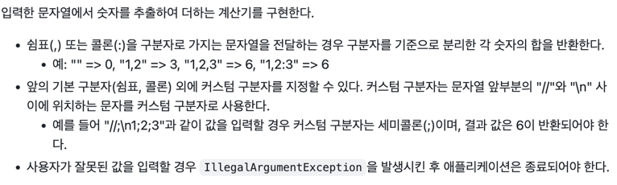
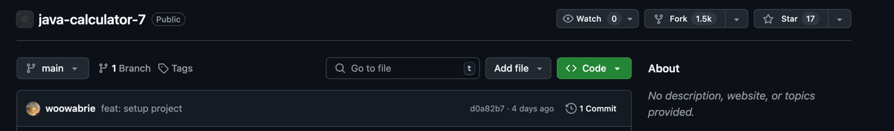

# 프리코스 1주 차 과제 - 문자열 덧셈 계산기 

---

> 우아한 테크코스 7기 프리코스 1주차 과제 문자열 덧셈 계산기를 구현한 저장소입니다.



## 목차

--- 

- [초기 설정](#초기-설정)
- [기능 목록](#기능-목록)
  - [문자열에서 숫자를 추출하여 더하기](#1-문자열에서-숫자를-추출하여-더하기)
  - [에러 처리](#2-에러-처리)


## 초기 설정

---

__1. 프로젝트를 자신의 저장소로 fork 하기__





__2. fork한 저장소를 내 컴퓨터로 clone 하기__

```java
git clone https://github.com/{본인_아이디}/{저장소 아이디}.git
ex) git clone https://github.com/sobaman/java-calculator-7.git
```
```java
// clone한 폴더로 이동하는 방법
cd {저장소 아이디}
ex) cd java-calculator-7
```


__3. 별도의 작업 공간 위한 브랜치 생성하기__

```java
git checkout -b {본인 아이디}
ex) git checkout -b sobaman
```


## 기능 목록

---

### 1. 문자열에서 숫자를 추출하여 더하기

#### 기본 구분자 
- 쉼표(,) 또는 콜론(:) 을 구분자로 가지는 문자열을 전달할 경우 구분자를 기준으로 분리한 각 숫자의 합을 반환한다

#### 커스텀 구분자
- 문자열 앞부분의 "//" 와 "\n" 사이에 위치하는 문자는 커스텀 구분자로 지정 가능하다

### 2. 에러 처리
- 사용자가 잘못된 값을 입력한 경우에 IllegalArgumentException 발생 후 어플리케이션을 종료한다