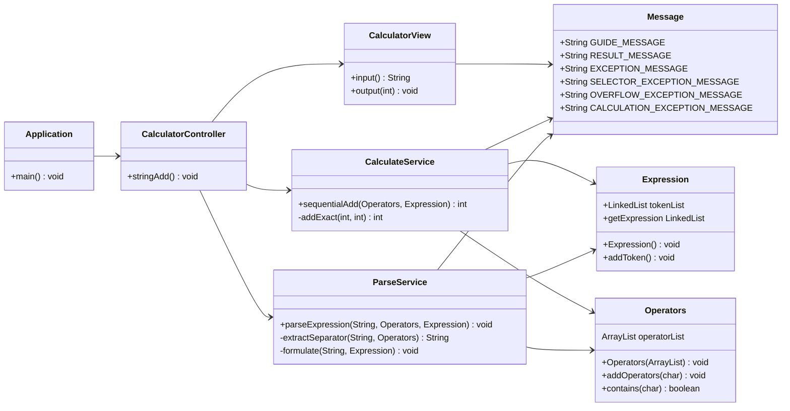

# 1주차 미션 : 문자열 덧셈 계산기

<details>
	<summary>과제 세부 내용</summary>

## 과제

- 입력한 문자열에서 숫자를 추출하여 더하는 계산기를 구현한다.
    - 쉼표(,) 또는 콜론(:)을 구분자로 가지는 문자열을 전달하는 경우 구분자를 기준으로 분리한 각 숫자의 합을 반환한다.
    - 예: "" => 0, "1,2" => 3, "1,2,3" => 6, "1,2:3" => 6
    - 앞의 기본 구분자(쉼표, 콜론) 외에 커스텀 구분자를 지정할 수 있다. 커스텀 구분자는 문자열 앞부분의 "//"와 "\n" 사이에 위치하는 문자를 커스텀 구분자로 사용한다.
    - 예를 들어 "//;\n1;2;3"과 같이 값을 입력할 경우 커스텀 구분자는 세미콜론(;)이며, 결과 값은 6이 반환되어야 한다.
    - 사용자가 잘못된 값을 입력할 경우 IllegalArgumentException을 발생시킨 후 애플리케이션은 종료되어야 한다.

### 입출력

- 입력 : 구분자와 양수로 구성된 문자열
- 출력 : 덧셈 결과

ex)

```
덧셈할 문자열을 입력해 주세요.
1,2:3 
결과 : 6
```

</details>

## 구현 아이디어
연산의 속성 : 수식, 숫자, 연산자
- 숫자는 이미 int의 형태로 존재함
-> 수식과 연산자를 model로 구현

현실의 덧셈 계산 과정에서 차용한 점
- 수식을 보면 이를 숫자와 연산자의 조합으로 바라봄
- 더하기나 빼기만 있는 식의 경우 앞에서부터 하나씩, 숫자와 연산자를 번갈아가며 순서대로 처리함
-> 수식을 Linked List로 표현하여 처리한다

## 구현 기능 목록 (함수 명세)

### Main
	main (calculate/Application)
	- 설명 : 계산기 실행을 Controller에게 요청한다. 
	- 입력 : String[] args
	- 반환 : -
	- 예외 : IllegalArgumentException (계산기 실행 과정에서 오류 발생시)

### Model (Class)
	Expression (calculate/model/Expr을ession)
	- 설명 : 수식을 나타내는 클래스이다. Object의 연결리스트로 구현되어 있으며 일반적으로 숫자(int)와 연산자(char)로 구성된다. 

	Operator  (calculate/model/Operator)
	- 설명 : 처리 가능한 연산자 목록이다. 문제 상황에서의 구분자에 해당하며 연산 과정에서 모두 덧셈으로 처리한다. 

### Controller
	stringAdd (calculate/controller/CalculatorController)
	- 설명 : 계산기를 실행한다. 
	- 입력 : -
	- 반환 : -
	- 예외 : IllegalArgumentException (계산기 실행 과정에서 오류 발생시)

### View
	input (calculate/view/CalculatorView)
	- 설명 : 입력값을 받는다. 
	- 입력 : -
	- 반환 : String
	- 예외 : -
	
	output (calculate/view/CalculatorView)
	- 설명 : 결과값을 출력한다. 
	- 입력 : int
	- 반환 : void
	- 예외 : -

### Service
	parseExpression (calculate/service/ParseService)
	- 설명 : 입력받은 문장에서 구분자를 추출하고 수식을 구성한다. 입력받은 Operators와 Expression에 이를 추가한다. 
	- 입력 : String, Operators, Expression
	- 출력 : -
	- 예외 처리 : IllegalArgumentException(숫자 형태의 구분자, 입력값 오버플로우)

	sequentialAdd (calculate/service/CalculateService)
	- 설명 : 입력받은 수식을 순차적으로 더해 결과값을 반환한다. 
	- 입력 : Operator, Expression
	- 반환 : int
	- 예외 : IllegalArgumentException(연산 과정의 오버플로우, 부적절하게 구성된 수식)

## Todo List

- ✅ 입력
    - 문자열을 입력받음
- ✅ 전처리
    - 입력받은 문자에서 커스텀 구분자 추출
    - 수식화 
    - 잘못된 입력값에 대한 예외를 처리
- ✅ 연산
    - 숫자를 더함
- ✅ 출력
    - 결과값을 출력함
- ✅ 리펙토링
	- MVC 모델로 변환
	- 복잡한 코드 흐름 개선
## 코드 흐름

```
1. "덧셈할 문자열을 입력해 주세요."를 출력 후 입력 대기
2. 문자열을 입력받은 후 전처리
	a. 커스텀 구분자 추출
	b. 구분자 목록에 커스텀 구분자 추가
	c. 입력받은 문자열을 식의 형태로 변환
	+ 문자열 중 예외 상황을 처리
3. 덧셈 연산
  a. 덧셈을 처리 (순차적으로 더해 나감)
  + 자료형의 범위를 넘어가는 입력값에 대한 예외처리
4. 포멧에 맞춰 출력
```

## 클래스 다이어그램


