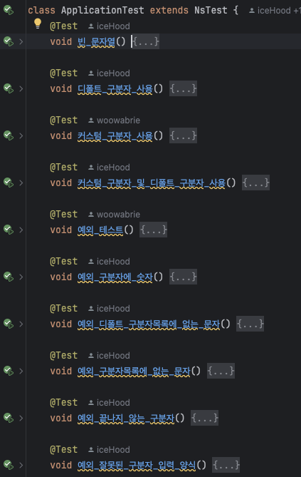

# java-calculator-precourse

# 진행과정

## 설계하기

### 요구 사항 분석

> 과제 진행 요구 사항
>
- 문자열 덧셈 계산기 → 포크 및 클론
- 기능목록들 → README.md 작성
- 커밋단위 == 기능목록

> 기능 요구 사항
>
- [x]  문자열 입력받기
- [x]  구분자 목록 만드는 기능
- [x]  구분자 목록 이용 → 숫자만 추출
- [x]  숫자들을 더해주는 기능

이렇게 만들면 될 듯싶습니다.

## 구현하기

### 문자열 입력받기

문자열을 입력받는 함수를 내부에 만들어주자.

main이 static이라서 readLine도 static으로 만들었다.

```java
private static String readLine() {
    return Console.readLine();
}
```

### 구분자 목록 만드는 기능

구분자 목록을 만들 때 기본적으로 `“,:”` 는 사용하도록 하는 것같다.

`기본 구분자(쉽표, 콜론) 외에 커스텀 구분자를 지정할 수 있다.` 를 기본 구분자에 커스텀 구분자를 추가하는 개념으로 해석했다.

커스텀 구분자의 경우 문자 하나하나를 구분자로 취급하겠다. ex. `“\\;[]\n”` ⇒ 구분자: `“,:;[]”`

> 예외사항
>
- 커스텀 구분자에 숫자가 들어가면 예외를 던지도록 해야겠다.
- 커스텀 구분자에 중복되는 것은 입력해도 괜찮다.
- 커스텀 구분자의 경우 입력 규칙을 지켜야 한다. “\\”과 “\n”사이에 있어야 한다.

이제 구현해보자.

> \\ 와 \n 사이의 문자열을 가져오기
>

만약 \\과 \n 구문이 없으면 기본 구분자만 반환하도록 하자.

```java
	private static HashSet<String> fetchSeparator(String input) throws IllegalArgumentException {
        HashSet<String> separators = new HashSet<>();
        separators.add(",");
        separators.add(";");

        int startIndex = input.indexOf('\\');
        int endIndex = input.indexOf('\n');

        if (startIndex == -1 && endIndex == -1) { // 커스텀 구분자가 없음
            return separators;
        }
        if (startIndex != 0 || endIndex == -1) { // 시작점이 처음이 아님 or 끝이 없음
            throw new IllegalArgumentException("커스텀 입력 형식이 올바르지 않음");
        }

        String separatorCandidate = input.substring(startIndex + 1, endIndex);

        for (int i = startIndex + 1; i < endIndex; i++) {
            char candidate = separatorCandidate.charAt(i);
            if ('0' <= candidate && candidate <= '9') {
                throw new IllegalArgumentException("숫자는 구분자가 될 수 없음");
            }
            separators.add(String.valueOf(candidate));
        }

        return separators;
    }
```

### 구분자를 이용한 숫자 추출

매개변수로 구분자와 input을 받아야한다.

\n이 있다면 그곳을 시작점으로 하고 아니면 0을 시작점으로 하자.

구분을 할 때 숫자와 구분자 순서대로 오게 될 것이다.

숫자가 여러자리가 될 수 있음에 유의하면서 파싱하자.

만약 숫자가 아닌 문자인데 구분자에 없으면 예외를 던지자.

- 숫자가 아닐 때까지 읽음
- 해당 문자가 구분자에 있으면 배열에 숫자 넣고 진행
- 해당 문자가 구분자에 없으면 예외를 던짐

```java
private static ArrayList<Integer> extractNumbers(String input, HashSet<String> separators) throws IllegalArgumentException {
        ArrayList<Integer> numbers = new ArrayList<>();
        int startIndex = input.indexOf("\\n");
        startIndex = startIndex == -1 ? 0 : startIndex + 2;
        int endIndex = startIndex;
        for ( ; endIndex < input.length(); endIndex++) {
            if ('0' <= input.charAt(endIndex) && input.charAt(endIndex) <= '9') {
                continue;
            }

            String numberCandidate = input.substring(startIndex, endIndex);
            if (separators.contains(String.valueOf(input.charAt(endIndex)))) {
                numbers.add(Integer.parseInt(numberCandidate));
                startIndex = endIndex+1;
            } else {
                throw new IllegalArgumentException("구분자 목록에 없는 문자임");
            }
        }
        if (endIndex == input.length()) {
            String numberCandidate = input.substring(startIndex, endIndex);
            if (!numberCandidate.isEmpty()) {
                numbers.add(Integer.parseInt(numberCandidate));
            }
        }

        return numbers;
    }
```

### 테스트 코드 추가 및 테스트

위에서 예상한 상황들에 대해 테스트 케이스를 추가하여 테스트해보자.



음… 솔직히 잘 모르지만? 대-충 이렇게 사용하나보다~ 했다…

---

## 노트

1. Java를 처음 사용하다보니 모르는 것들을 찾는 것에 시간이 많이들었다.
2. 예외사항을 생각하다보니 예외가 꽤 많을 것같은데… 일단 여기서 턴을 마치겠다.
3. 이게맞나… 싶은 코드긴하다…