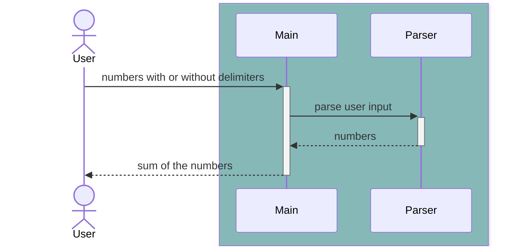

# [java-calculator-precourse](https://apply.techcourse.co.kr/assignment/14/mission/43)

## 계획 (기능)

### 1. 간단하게 돌아가는 프로그램 작성

- 사용자로부터 입력받기
- 입력받은 문자열을 파싱하기
    - 커스텀 구분자 파싱하기
    - 숫자 파싱하기
- 숫자 더하기

### 2. 숫자 유형 확장하기

- 실수 허용하기

### 3. 리팩터링

- `lexer`, `parser` 분리하기

## Sequence

### `SimpleParser` (`Stream`과 `RegEx`를 통해 구현)

