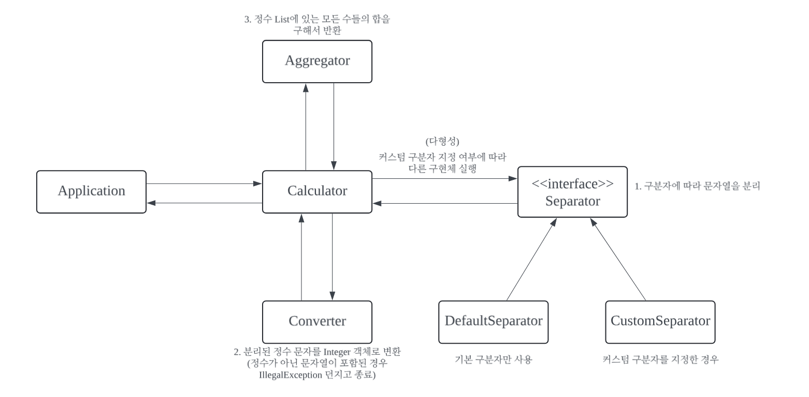

# java-calculator-precourse

# 구현할 기능 목록



사용자가 눈으로 확인할 수 있는 요소(View)와 눈으로 확인할 수 없는 내부적인 요소(Service)로 패키지를 분리할 계획입니다.

- 계산기에서 눈으로 확인할 수 있는 요소는 입출력 결과를 볼 수 있는 화면과 입력창이 있고,   
- 계산기에서 눈으로 확인할 수 없는 요소는 입력값 검증 및 연산 수행 등이 있습니다.

## View

사용자가 눈으로 확인할 수 있는 요소를 포함합니다.

- 계산을 위한 값 입력받기
  - [X] `덧셈할 문자열을 입력해 주세요.` 문자열 출력하기
  - [X] 문자열 입력받기

- 계산 결과 출력하기
  - [ ] `결과 : ${결과}` 형식으로 계산 결과 출력하기

## Service

사용자가 눈으로 확인할 수 없는 내부적인 요소를 포함합니다.

- 입력값 검증하기
  - [ ] 커스텀 구분자 확인하기
    - [ ] 문자열 앞에 `//`와 `\n` 사이에 위치하는 값 존재 여부 확인하기
    - [ ] 커스텀 구분자를 추가한다면, [Custom Separator Rule](#custom-separator-rule)을 위배하지 않는지 검증하기
  - [ ] 구분자(커스텀 구분자 포함)를 기준으로 문자열 분리하기
  - [ ] 분리된 문자열이 [양수](#양수)인지 검증하기
  - [ ] 분리된 문자열을 숫자 타입으로 변경하기
  - [ ] 잘못된 값을 입력할 경우 `IllegalArgumentException`을 발생시키기 (모든 검증 로직에 포함됩니다.)

- 계산하기
  - [ ] 정상적으로 계산할 수 있는지 검증하기
    - [ ] 오버플로우 가능성 확인하기
  - [ ] 각 숫자의 합을 반환하기

### Custom Separator Rule

커스텀 구분자를 위한 규칙입니다. 규칙에 위배되는 경우 커스텀 구분자로 사용할 수 없습니다.

- 기본 구분자(쉼표, 콜론)를 커스텀 구분자로 사용할 수 없습니다.
- 숫자는 커스텀 구분자로 사용할 수 없습니다.
- 공백은 커스텀 구분자로 사용할 수 없습니다.
- `.`, `+`, `/`, `=`, `(`, `^` 등 수학적으로 인식할 수 있는 기호는 커스텀 구분자로 사용할 수 없습니다.
- 알파벳, 특수 기호, 한글 등의 단일 문자(character)가 아닌 경우 커스텀 구분자로 사용할 수 없습니다.
  - `a`, `$`, `가`와 같이 단일 문자이면서 다른 규칙에 위배되지 않는 경우 사용 가능합니다.
  - `abc`, `안녕`과 같이 단일 문자가 아닌 경우 사용할 수 없습니다.
- 계산을 위한 하나의 문자열에는 하나의 커스텀 구분자만 추가할 수 있습니다. (2개 이상은 사용할 수 없습니다.)

### 양수

0보다 큰 수를 의미하며, 양수 앞에 + 부호를 붙이는 것은 허용되지 않습니다. 

- 예를 들어, "3"은 올바른 입력이지만, "+3"은 잘못된 입력으로 간주됩니다.

---

## 실행 예시

```text
덧셈할 문자열을 입력해 주세요.
1,2:3
결과 : 6
```

- 입력값은 구분자와 양수로 구성된 문자열입니다.
- 덧셈 결과를 출력합니다.
- 문자열을 출력할 때 줄 바꿈이 필요합니다.

---

# 커밋 컨벤션

커밋 단위는 앞에서 정리한 구현할 기능 목록 단위로 진행됩니다.  
[AngularJS Git Commit Message Conventions](https://gist.github.com/stephenparish/9941e89d80e2bc58a153)를 참고하여 커밋 컨벤션을 구성하였습니다.

```text
<작업 유형>(<적용 범위>): <주제>

<본문>
```

## 작업 유형

커밋의 유형을 표시합니다.

- **feat**: 새로운 기능 추가
- **fix**: 버그 수정
- **docs**: 문서 관련 변경 사항
- **style**: 코드 스타일 변경 (포맷팅, 세미콜론 추가 등, 로직 변화 없음)
- **refactor**: 코드 리팩토링 (버그 수정이나 기능 추가가 아닌 코드 구조 변경)
- **test**: 테스트 추가 또는 수정

## 적용 범위 (선택 사항)

변경된 코드 영역을 의미합니다.

- 예시: `view`, `service` 등

## 주제

커밋의 주제를 간단히 작성합니다.

- 명령형으로 작성합니다.
- 문장 끝에 마침표를 사용하지 않습니다.
- 예시 : `fix(service): 커스텀 구분자 입력 값 검증 오류 수정`

## 본문 (선택 사항)

- 변경(및 추가) 이유와 변경된 부분의 자세한 내용을 설명합니다.
- 현재 시제 문장 형태로 작성합니다.
- 이전 동작과의 차이점을 작성합니다.

## 커밋 메시지 예시

```text
docs: 구현할 기능 목록 작성
```

```text
feat(view): 결과 출력 기능 구현
```

```text
fix(service): 커스텀 구분자 입력값 검증 오류 수정

숫자를 커스텀 구분자로 입력할 수 있던 문제를 해결합니다.
이전에는 숫자가 구분자로 허용되었으나, 이제는 숫자가 구분자로 사용되지 않도록 검증 로직이 추가됩니다.
```
