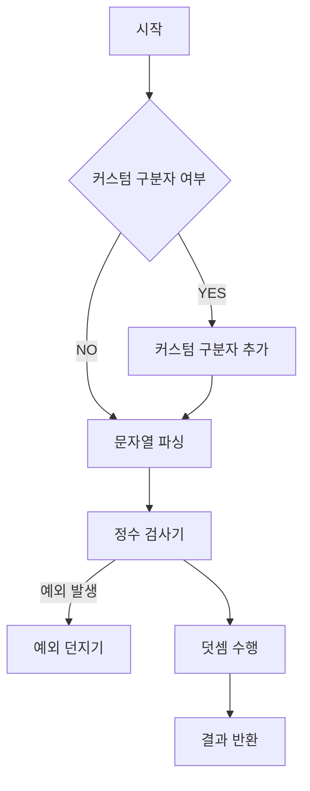
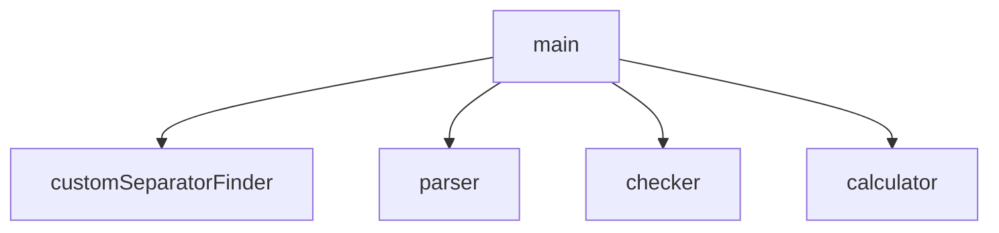

# java-calculator-precourse

## 기능 요구사항

- 입력한 문자열에서 숫자를 추출하여 더하는 계산기
- 쉼표(,) 또는 콜론(:)을 구분자로 가지는 문자열을 전달하는 경우 구분자를 기준으로 분리한 각 숫자의 합을 반환한다.
  - 예: "" => 0, "1,2" => 3, "1,2,3" => 6, "1,2:3" => 6
- 앞의 기본 구분자(쉼표, 콜론) 외에 커스텀 구분자를 지정할 수 있다. 커스텀 구분자는 문자열 앞부분의 "//"와 "\n" 사이에 위치하는 문자를 커스텀 구분자로 사용한다.
  - 예를 들어 "//;\n1;2;3"과 같이 값을 입력할 경우 커스텀 구분자는 세미콜론(;)이며, 결과 값은 6이 반환되어야 한다.
- 사용자가 잘못된 값을 입력할 경우 IllegalArgumentException을 발생시킨 후 애플리케이션은 종료되어야 한다.

### 직접 추가한 기능 요구사항

- 정수의 길이는 10^2147483647이라고 가정한다.
- 커스텀 구분자는 최대 1개만 추가 가능하다고 가정한다.
- 빈 문자열은 0이라고 간주한다.
- 문자열의 마지막이 구분자로 끝날 경우, 맨 마지막에는 0이 들어온 것이라 가정한다.
- 정수도 구분자가 될 수 있다고 가정한다.

### 알고리즘 순서도

### 아키텍처 설계

### 계약 설정

- main
  - Application 클래스
  - psvm 을 갖고 있음
  - JVM을 띄우고, 
  - 다른 클래스들에 기능을 위임한 뒤, 
  - 계산된 결과값을 출력하고, 
  - 메인 스레드를 종료
- customSeparatorFinder
  - 커스텀 구분자를 탐색하는 기능을 가진 클래스
  - 사전조건
    - 문자열을 입력받는다.
  - 기능
    - 문자열의 길이가 5 미만이면, null을 반환한다.
    - 문자열의 길이가 5 이상이면, 0, 1번 인덱스가 '/' 인지 확인하고, 3번 인덱스가 \인지 확인한 뒤, 4번 인덱스가 n인지 확인한다.
      - 아니라면 null을 반환한다.
    - 2번 인덱스의 문자와, 4번 인덱스까지의 문자를 제거한 문자열을 반환한다.
  - 사후조건
    - 조건에 따라, Optional 문자 객체 및 변경된 문자열을 반환한다.
- parser
  - 주어진 문자열 구분자에 따라, 문자열을 파싱하는 클래스
  - 사전조건
    - 문자열과 구분자 리스트를 입력받는다
  - 기능
    - 주어진 구분자를 따라, 문자열을 파싱하여 리스트에 추가한다
  - 사후조건
    - 파싱된 문자열 리스트를 반환한다
- checker
  - 주어진 문자열 리스트가 모두 정상적인 정수로 이루어져있는지 확인하는 클래스
  - 사전조건
    - 구분자 문자열과, 파싱된 문자열 리스트를 입력받는다
  - 기능
    - 문자열 리스트가 모두 
      - 0으로 시작하지 않고, 
      - 문자열 구분자를 포함하지 않으며, 
      - 정수 형태가 아닌 문자가 없는지 검사한다.
    - 만약 모든 정상 조건을 만족하지 못한다면, IllegalArgumentException 을 던진다.
  - 사후조건
    - 아무것도 반환하지 않는다.
- calculator
  - 주어진 문자열을 덧셈한 결과값을 반환하는 클래스
  - 사전조건
    - 파싱된 문자열 리스트를 입력받는다.
  - 기능
    - 덧셈을 수행한다
  - 사후조건
    - 덧셈이 수행된 하나의 문자열을 반환한다.