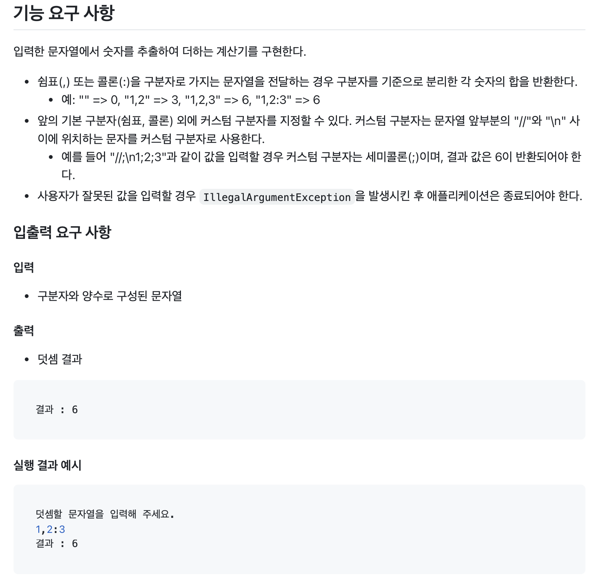
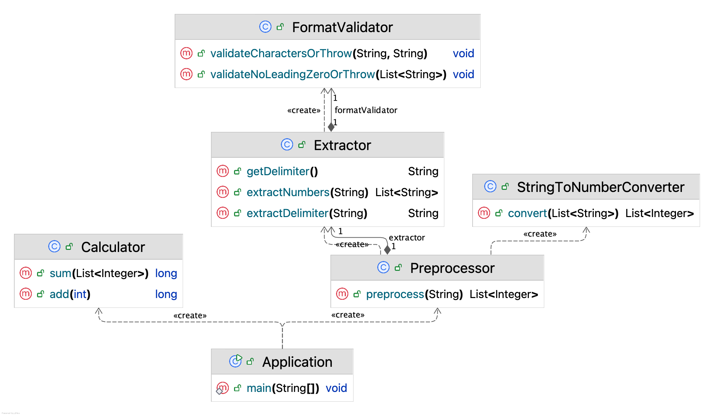

# 🔢 문자열 덧셈 계산기

## 기능 명세서

- [X] 사용자에게 문자열을 입력받는다.  
- [X] 숫자를 추출한다.
    - [X] 구분자를 확인한다.
        - [X] 커스텀 구분자를 확인한다.
            - [X] 1개의 문자만 커스텀 구분자로 사용 가능하다.
        - [X] 커스텀 구분자를 지정하지 않은 경우 기본 구분자를 사용한다.
            - [X] 기본 구분자는 쉼표(,) 또는 콜론(;)이다.
    - [X] 입력 형식이 잘못된 경우 `IllegalArgumentException`을 발생시킨다.
        - [X] 문자열에 숫자와 해당하는 구분자 외에 다른 문자가 있는 경우
        - [X] 숫자를 나타내는 문자열이 "0"으로 시작하는 경우
    - [X] 입력된 문자열을 구분자를 기준으로 분리한다.
    - [X] 문자열 형태의 숫자를 십진수로 변환한다.
        - [X] 빈 문자열은 0으로 변환한다.  
- [X] 추출한 숫자들의 합을 구한다.  
- [X] 계산 결과를 출력한다.  
- `IllegalArgumentException`이 발생하면 애플리케이션을 종료한다.

## 클래스 다이어그램

