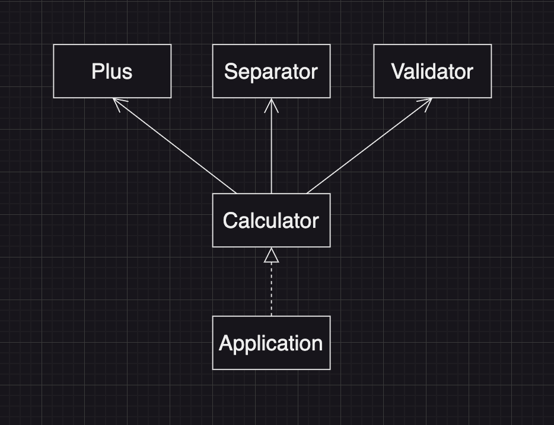

# java-calculator-precourse

# 프리코스 목표 설정

- **객체지향적인 설계를 생각해보자**
- **테스트 주도 개발(TDD)를 익혀보자**
- **리펙터링 습관화를 하자**

# 기능 목록

## Class Diagram

## Separator Class

- [x] 테스트 코드 작성
- [ ] 구분자 리스트 생성
- [ ] 구분자 기준 문자열 분리 기능 구현

## Validator Class

- [ ] 테스트 코드 작성
- [ ] 빈 입력값 시, 에러 처리 추가
- [ ] 음수 입력 시, 에러 처리 추가
- [ ] 올바른 커스텀 구분자 생성 컨벤션이 아닐 시, 에러 처리 추가
- [ ] 커스텀 구분자가 올바른 값이 아닐 시, 에러 처리 추가

## Plus Class

- [ ] 테스트 코드 작성
- [ ] 누적 합 기능 구현

## Calculator Class

- [ ] 로직에 필요한 객체 생성

## Application Class

- [ ] 사용자 입력 추가
- [ ] 사용자 Calculator 객체 생성
- [ ] try-catch문 작성