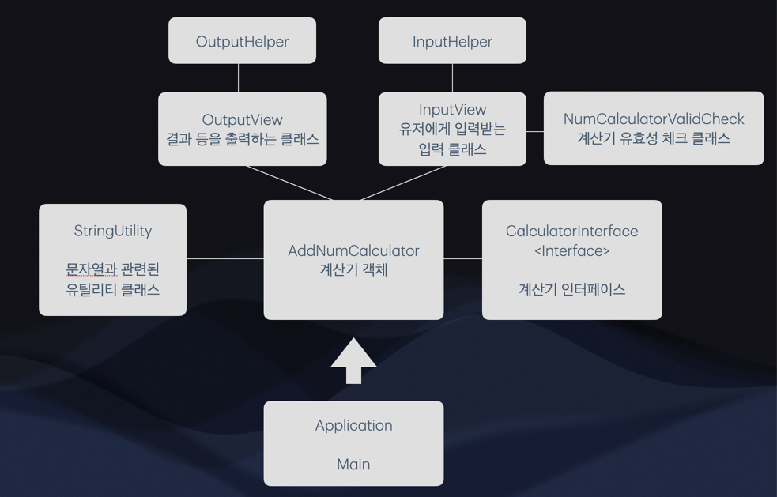

# java-calculator-precourse
implement : 핍비

# 기능 목록
- 계산기 실행
- 문자열 입력
- 구분자에 기반한 문자열 분리
- 분리된 문자열의 숫자 합 반환
- 커스텀 구분자 지정
- 사용자에게 결과 출력
- 입력이 올바르게 왔는지 확인하는 유효성 검사

# 초기 구조 설계
해당 기능을 구현하기 위해 아래와 같이 초기 클래스 구조를 설계했습니다.

# 최종 구조
최종적으로는 다음의 구조를 사용하게 되었습니다.

# 세부 구현사항
## 커스텀 구분자
- 커스텀 구분자를 추가하는 부분이 항상 맨앞에 와야한다는 점
- 커스텀 구분자가 "문자"라는 점에서 다음과 같은 구조를 맨 앞에서 찾도록 합니다.
  - [커스텀 구분자 시작 문자열][커스텀 구분자][커스텀 구분자 끝 문자열]
- 커스텀 구분자가 존재한다면, 맨 앞에 위치해야하며 그렇지 않다면 유효하지 않은 입력으로 간주합니다.
- 또한 커스텀 구분자는 숫자일 수 없다고 판단하였습니다. 
  - 만약 커스텀 구분자가 숫자라면 숫자값 입력과 구분할 수 없기 때문입니다.

## error throw 원칙
- isValid 등 규칙 준수를 판별하는 메서드의 경우 규칙을 어기더라도 throw하는 것이 아닌 boolean을 리턴하도록 하였습니다
- 그에 반면 getCustomSplitter 등 규칙 판별이 목적이 아닌 경우 해당 메서드를 사용함에 지켜야 할 규칙을 어겼다면 throw하도록 하였습니다.

