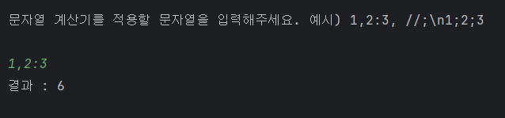
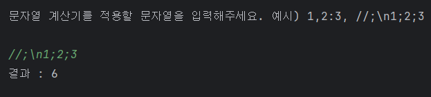
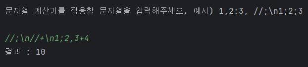
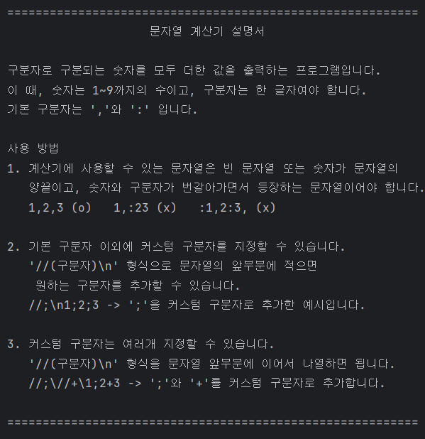

# 🔢 우테코 프리코스 1주차 - 문자열 덧셈 계산기


## 🔍목차

1. [개요](#1-개요)
2. [주요 기능](#2-주요-기능)
3. [설치 및 시작하기](#3-설치-및-시작하기)
4. [프로젝트 구조](#4-프로젝트-구조)
5. [구현 기능 목록](#5-구현-기능-목록)

## 1. 개요

### Team

- 윤상민

### Project Summary

구분자와 숫자로 이루어진 문자열을 입력 받으면 숫자만 추출해서 모두 더한 값을 출력하는 프로그램입니다. 기본 구분자 이외의 커스텀 구분자를 지정 가능하며, 잘못된 문자열을 입력할 경우 에러를 발생시켜 사용자에게
알려줍니다.
<br><br>

## 2. 주요 기능

- **구분자로 구분된 숫자들의 합을 출력합니다.**

  

  기본 구분자는 ','와 ':' 입니다. <br><br><br>

- **기본 구분자 이외에 커스텀 구분자를 지정할 수 있습니다.**

  

  //(구분자)\n 형식으로 커스텀 구분자를 지정 가능합니다. 위 예시에는 ';' 을 커스텀 구분자로 지정했습니다.
  <br><br><br>

- **커스텀 구분자를 복수 지정할 수 있습니다.**

  

  '//(구분자)\n' 형식을 이어서 작성하는 것으로 여러 개의 커스텀 구분자를 지정할 수 있습니다.<br>
  위 예시는 ';'와 '+'를 커스텀 구분자로 지정했습니다.
  <br><br><br>

- **프로그램을 실행할 시에 사용자에게 위 기능을 설명하는 설명서를 제공합니다.**

  

## 3. 설치 및 시작하기

#### Prerequisite

- **Java**
- **Gradle** build tool

<br>
레포지토리를 clone하고 IntelliJ IDEA, Eclipse 등의 IDE에서 src/main/java에 있는 Application.java를 실행합니다.

```conventionalcommit
$ git clone https://github.com/cinador/java-calculator-7.git
```

## 4. 프로젝트 구조

```
📦src
┣ 📂main
┃ ┗ 📂java
┃ ┃ ┗ 📂calculator
┃ ┃ ┃ ┣ 📂controller
┃ ┃ ┃ ┃ ┗ 📜CalculatorController.java
┃ ┃ ┃ ┣ 📂model
┃ ┃ ┃ ┃ ┣ 📜AroundNewSeparator.java
┃ ┃ ┃ ┃ ┗ 📜Separator.java
┃ ┃ ┃ ┣ 📂service
┃ ┃ ┃ ┃ ┣ 📜CalculatorService.java
┃ ┃ ┃ ┃ ┣ 📜SeparatorService.java
┃ ┃ ┃ ┃ ┗ 📜SumService.java
┃ ┃ ┃ ┣ 📂view
┃ ┃ ┃ ┃ ┗ 📜CalculatorView.java
┃ ┃ ┃ ┗ 📜Application.java
┗ 📂test
┃ ┗ 📂java
┃ ┃ ┗ 📂calculator
┃ ┃ ┃ ┣ 📂model
┃ ┃ ┃ ┃ ┗ 📜SeparatorTest.java
┃ ┃ ┃ ┣ 📂service
┃ ┃ ┃ ┃ ┣ 📜CalculatorServiceTest.java
┃ ┃ ┃ ┃ ┣ 📜SeparatorServiceTest.java
┃ ┃ ┃ ┃ ┗ 📜SumServiceTest.java
┃ ┃ ┃ ┗ 📜ApplicationTest.java
```

## 5. 구현 기능 목록

- **사용자와의 상호작용, 입출력 기능** : CalculatorView.java


- **기본 구분자와 커스텀 구분자 저장** : Separator.java


- **커스텀 구분자를 둘러싸고 있는 문자 패턴 저장** : AroundNewSeparator.java


- **커스텀 구분자가 있는 지 판단하고, 커스텀 구분자 추출** : SeparatorService.java


- **숫자와 구분자로 이루어진 문자열에서 숫자들의 합 계산, 잘못된 문자열 판단** : SumService.java


- **각 클래스들에게 정보를 전달하는 역할** : CalculatorController.java, CalculatorService.java


- **JUnit5를 이용한 테스트 코드** : *Test.java

