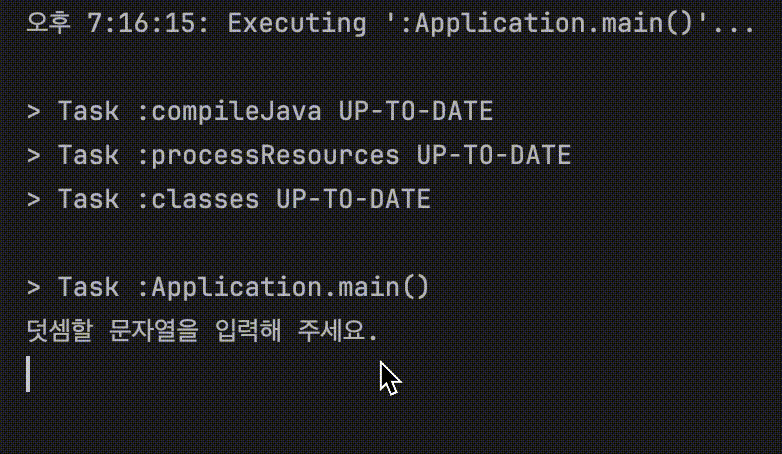

    

# 프리코스 1주차 미션 - 문자열 덧셈 계산기

---

> 우아한테크코스 7기 프리코스 1주차 미션, 문자열 덧셈 계산기를 구현한 저장소입니다.

 

# 목차

- ### [기능 요구 사항](#기능-요구-사항)
- ### [자체 구현 사항](#자체-구현-사항)
- ### [동작 흐름](#동작-흐름)
- ### [기능 목록](#기능-목록)
    - #### [입력 처리](#1입력-처리)
    - #### [로직 구현](#2-로직-구현)
    - #### [출력 처리](#3-출력-처리)
    - #### [예외 처리](#4-예외-처리)
    - #### [테스트](#5-테스트)

---

## 기능 요구 사항

- #### 쉼표(,) 또는 콜론(:)을 구분자로 가지는 문자열을 전달하는 경우 구분자를 기준으로 분리한 각 숫자의 합을 반환한다.
    - 예: "" => 0, "1,2" => 3, "1,2,3" => 6, "1,2:3" => 6
- #### 앞의 기본 구분자(쉼표, 콜론) 외에 커스텀 구분자를 지정할 수 있다. 커스텀 구분자는 문자열 앞부분의 "//"와 "\n" 사이에 위치하는 문자를 커스텀 구분자로 사용한다.
    - 예: "//;\n1;2;3"과 같이 값을 입력할 경우 커스텀 구분자는 세미콜론(;)이며, 결과 값은 6이 반환되어야 한다.
- #### 사용자가 잘못된 값을 입력할 경우 IllegalArgumentException 을 발생시킨 후 애플리케이션은 종료되어야 한다.

---

## 자체 구현 사항

- #### 구분자가 아닌 문자열이 입력될 경우 IllegalArgumentException 을 발생시킨 후 애플리케이션은 종료되어야 한다.
    - 예: "1,2//3" => 오류 메시지 출력
- #### 커스텀으로 하이픈(-)을 구분자로 가지는 문자열은 음수 예외 처리에서 제외
    - 예: "//-\n-1-2-3" => 1+2+3 => 6
    - -1-2,3에서 -1을 양수로 판단한 이유는 ""빈 문자열은 0으로 판단하기에 "-1"일 경우 0+1로 판단

---

## 동작 흐름

- `덧셈할 문자열을 입력해 주세요.` 가 콘솔에 출력된다
- 사용자로부터 구분자와 양수로 구성된 문자열을 입력 받는다
    - 잘못 입력된 경우 `IllegalArgumentException`을 발생시키고 애플리케이션을 종료시킨다
    - 정상 입력된 경우 입력에 따른 결과를 반환한다
        - 구분자를 기준으로 나뉜 숫자의 합을 반환한다.
        - `결과 : value` 형태로 출력 후 애플리케이션 종료

---

## 기능 목록

### 1.입력 처리

- **기능**: 사용자로부터 문자열 입력받기
    - **입력 형식**: String
    - **유효성 검사**: 문자열 숫자가 양수인지 검사

### 2. 로직 구현

- **기능**: 문자열이 기본 구분자인지 커스텀 구분자인지 판단
    - `알고리즘`: 문자열 앞에 "// \n" 있는지 탐색 **[단순 탐색]**

- **기능**: 문자열에서 구분자 찾기
    - `알고리즘`: 기본 구분자면 [쉼표(,),콜론(:)] / 커스텀이면 [// \n 사이에 있는 문자열] **[단순 탐색]**

- **기능**: 문자열을 기본 구분자로 숫자 나누기
    - `알고리즘`: 쉼표(,) 또는 콜론(:)이 나올 때 까지 숫자 붙히기 **[전체 탐색]**

- **기능**: 문자열을 커스텀 구분자로 숫자 나누기
    - `알고리즘`:// \n 문자열 사이에 존재하는 모든 문자열을 구분자로 숫자를 나눔 **[전체 탐색]**

- **기능**: 나눠진 String 타입의 숫자들을 int 형으로 변환 후 덧셈
    - `알고리즘`: String -> Integer -> int 변환, 단순 덧셈 **[단순 변환 및 덧셈]**

### 3. 출력 처리

- **기능**: 결과 출력
    - **출력 형식**: `결과 : 6`

### 4. 예외 처리

- **기능**: 잘못된 입력 처리
    - **오류 메시지**: `IllegalArgumentException: 양수만 입력 가능합니다.`

### 5. 테스트

- **기능**: 테스트 케이스 작성
    - **케이스 1**: `"" => 0`
    - **케이스 2**: `"1,2:3" => 6`
    - **케이스 3**: `"//:,;\n1:,;2" => 3`
    - **케이스 4**: `"//-\n-1-2-3" => 6`
    - **케이스 5**: `"1,2//3" => 오류 메시지 출력`
    - **케이스 6**: `"-1,2:3" => 오류 메시지 출력`
    - **케이스 7**: `"1,2//3\n" => 오류 메시지 출력`
