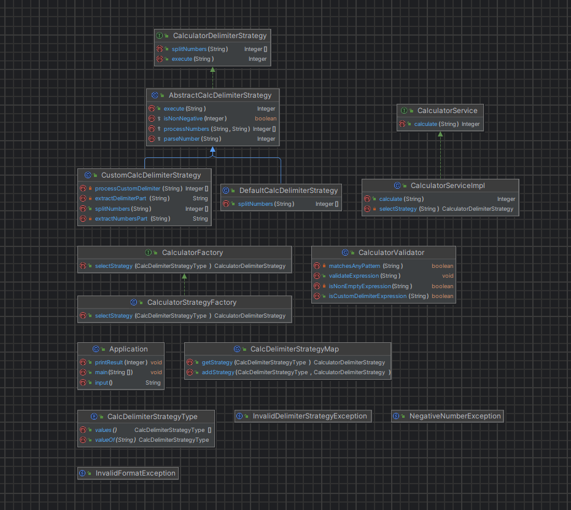

# ⭐프리코스 1주차 미션 - 문자열 덧셈 계산기

## 🏳️기능 요구 사항
입력한 문자열에서 숫자를 추출하여 더하는 계산기를 구현한다.

- 쉼표(,) 또는 콜론(:)을 구분자로 가지는 문자열을 전달하는 경우 구분자를 기준으로 분리한 각 숫자의 합을 반환한다.
  - 예: "" => 0, "1,2" => 3, "1,2,3" => 6, "1,2:3" => 6
- 앞의 기본 구분자(쉼표, 콜론) 외에 커스텀 구분자를 지정할 수 있다. 커스텀 구분자는 문자열 앞부분의 "//"와 "\n" 사이에 위치하는 문자를 커스텀 구분자로 사용한다.
  - 예를 들어 "//;\n1;2;3"과 같이 값을 입력할 경우 커스텀 구분자는 세미콜론(;)이며, 결과 값은 6이 반환되어야 한다.
- 사용자가 잘못된 값을 입력할 경우 `IllegalArgumentException`을 발생시킨 후 애플리케이션은 종료되어야 한다.

## 📂클래스 다이어그램

## ⚙️구현 기능
| 번호 | 구현 기능                                                                                                                    |
|----|--------------------------------------------------------------------------------------------------------------------------|
| 1  | **Delimiter에 따른 전략 인터페이스 구성**                                                                                            |
| 2  | **Delimiter에 따른 전략 구현체 클래스 생성**  - CustomDelimiter에 대한 처리   - DefaultDelimiter에 대한 처리                             |
| 3  | **공통된 처리를 담당하는 추상 클래스 생성**  - 숫자로 타입 변환  - 음수에 대한 기저 처리                                                          |
| 4  | **전략을 선택하는 팩토리 인터페이스를 구성**                                                                                               |
| 5  | **전략을 선택하는 팩토리 구현체 클래스 생성** - 전략 클래스를 담는 일급 컬렉션 구성 - 전략에 대한 선택 처리 - 기본 전략 주입                                 |
| 6  | **서비스 클래스 인터페이스 생성**                                                                                                     |
| 7  | **서비스 클래스 구현체 생성**  - 팩토리 클래스를 통해서 전략 생성 - 생성된 전략을 통해서 계산 진행 및 반환                                                |
| 8  | **Application 클래스 내에 입 출력 처리**  - `missionutils` 에서 지원하는 메소드를 활용하여 입력 처리  - 서비스 클래스를 사용하여 계산 진행 및 출력             |
| 9  | **Validator를 통한 Exception 처리**  - 잘못된 Format에 대한 Exception 처리   - 음수 값에 대한 Exception 처리  - 잘못된 전략에 대한 Exception 처리 |

## ✅ 구현 기능 개발 TODO

- [ x ] 1 번 기능
- [ x ] 2 번 기능 
- [ x ] 3 번 기능
- [ x ] 4 번 기능
- [ x ] 5 번 기능
- [ x ] 6 번 기능
- [ x ] 7 번 기능
- [ x ] 8 번 기능
- [ x ] 9 번 기능

## 🔥개발 방향
초기에 `Delimiter`에 따른 2가지 방법으로 해당 계산기가 동작한다고 생각했고, 이를 Strategy Pattern을 사용해서 극복하면 좋을 것 같다고 생각했다. 추후에 다양한 전략에 추가되는 것을 허용하면서 조금 더 확장성있는 코드를 작성하고자 하였다. 또한, 공통된 동작에 한해서는 abstract class를 통해서 구성하였으며, 이를 통해 코드를 Recyclable하게 구성될 수 있도록 노력했다.

최대한 의존성을 낮추기 위해서 노력했고, 추후에 다른 기능이 추가 될 수 있는 가능성을 두고 개발을 하고자 노력했다. 또한 주석없이 읽을 수 있는 코드를 목적으로 메소드 분리하였다.

## 😊소감
아직 부족한 부분이 많고, 코드의 `옳은 방향`을 찾아나가는 중이지만, 해당 과제를 통해서 많은 생각을 할 수 있는 계기가 된 것 같다.