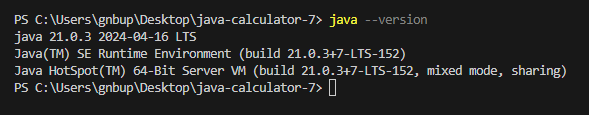
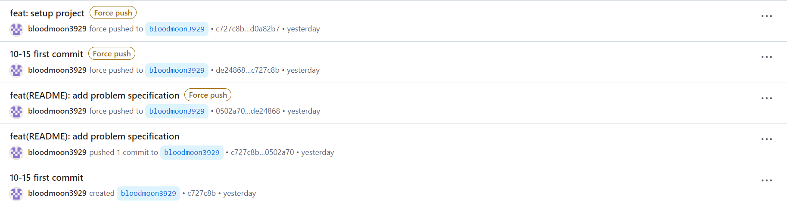
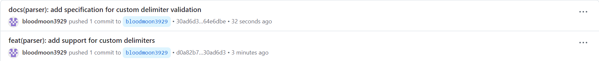

# java-calculator-precourse

## 과제일
> 10/15(화) ~ 10/20(월)

## 사용 IDE
사용한 IDE는 `Visual Studio Code`이며, 적용된 java 버젼은 다음과 같다.<br>
<br>


## 기능 요구사항
입력한 문자열에서 숫자를 추출하여 더하는 계산기를 구현한다.

1. 빈 문자열이 주어질시 0을 반환
2. 문자열은 쉼표(,)과 콜론(:)을 기준으로 문자열을 분리하여 더함
   - 문자열 처음에 "//"와 "\n" 사이의 입력은 커스텀 구분자이며, 기존의 구분자도 사용한다.
3. 사용자가 잘못된 값을 입력하면 `IllegalArgumentException` 발생후 종료

### 입력 조건
구분자와 양수로 구성된 문자열

### 출력 조건
입력 전 `덧셈할 문자열을 입력해 주세요.`을 출력,<br>
입력 값을 받은후 더한 값을 출력

### 예제 입출력
test 1.
```
> 덧셈할 문자열을 입력해 주세요.

> 결과 : 0
```
test 2.
```
> 덧셈할 문자열을 입력해 주세요.
1,2
> 결과 : 3
```
test 3.
```
> 덧셈할 문자열을 입력해 주세요.
1,2:3
> 결과 : 6
```
test 4.
```
> 덧셈할 문자열을 입력해 주세요.
//-\n1,2-3
> 결과 : 6
```
## 명세 (v2)
1. 입력 (해결)
> 문제의 조건대로 `import camp.nextstep.edu.missionutils.Console;`의 `Console.readLine();` 사용할 것

2. 빈 문자열인지 검사 (해결)
> 빈 문자열일 경우 0을 반환함
```java
if(S==null||S.isEmpty())
   return 0;
```

3. 커스텀 구분자 확인
> 구분자들을 저장할 문자열 배열에 커스텀 구분자 추가
`char[] separators = {',', ':'};`<br>
기존의 구분자를 저장할 변수

(가정) 커스텀 구분자는 입력의 처음 부분에 나오며, 한 개의 구분자를 추가할 수 있다는 가정

입력이 이스케이프 시퀀스가 아닌 문자열로써 동작함을 확인함
`System.out.println(S.charAt(x));`

stsrtWith함수를 통해 입력 값의 시작부가 '//'로 시작하는 지 확인함
- 커스텀 구분자를 추가하는 문자열의 뒤부터 복사하는 함수를 사용
- temp 변수의 크기를 기존보다 하나 큰 사이즈로 만들고,
- temp 변수에 separators 변수를 복사하고, 추가된 커스텀 구분자를 추가함
- separators 변수에 temp 변수 추가함
- 예외 발생시 IllegalArgumentException 반환


4. 연산 진행
> 숫자를 제외한 구분자들이 구분자 배열 내부에 없다면, 예외를 발생 후 종료

Pattern 변수에 separators에 or 연산자를 추가함
str변수를 Pattern 기준으로 분할하여 number 문자열에 추가함

음수일때의 예외 처리함

number의 값을 숫자로 변환하지 못할 때, 예외처리함 


## 후기
혼자 할 때는 github Desktop을 사용하여 commit을 진행하였기에 commit관련 오류가 많았음

10-15일<br>
특히 commit을 지우려다 오히려 과거의 commit이 복사되었다.<br>
<br>

10-16일<br>
파일을 저장하는 것을 까먹고 commit 해버림<br>
<br>
문제를 testcase를 읽어보니 출력문을 사용하여 값을 출력하는 것이 아니였기에 내일 다시 작성할 예정

## 참고
[문제 설명](https://apply.techcourse.co.kr/assignment/14/mission/43)<br>
[프리코스 과제 가이드](https://github.com/woowacourse/woowacourse-docs/tree/main/precourse)<br>
[Java 코드 컨벤션](https://github.com/woowacourse/woowacourse-docs/tree/main/styleguide/java)