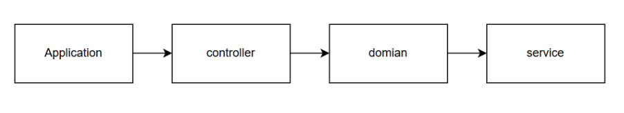

# java-calculator-precourse

> -  입력받은 문자열을 특정 구분자로 분리한 뒤, 숫자들의 합을 계산하는 간단한 문자열 계산기 애플리케이션입니다. MVC(Model-View-Controller) 패턴을 적용하여, 입력/출력과 비즈니스 로직을 명확히 분리하고 유지보수성과 확장성을 높였습니다.




## **Application.java**  
  > 애플리케이션 시작점으로 `CalculatorController`를 생성하여 전체 프로세스를 시작합니다.

## **controller/CalculatorController.java**  
  > 전체 흐름(Controller)을 담당하는 클래스입니다.  
  - 사용자의 입력을 받아 `CalculatorInput` 객체를 생성합니다.  
  - 이 입력 객체를 `CalculatorService`에 전달하여 계산 결과를 얻습니다.  
  - 최종 결과를 콘솔에 출력합니다.  
  - 컨트롤러는 비즈니스 로직을 직접 수행하지 않고 서비스 계층에 위임합니다.

##  **domain/CalculatorInput.java**  
  > 사용자가 입력한 문자열을 나타내는 도메인 객체입니다.  
  - 구분자를 파싱하거나 기본 구분자(`,`나 `:`)를 사용하도록 지원할 수 있습니다.  
  - 인풋 검증 로직을 추가하여 예외 상황 처리도 가능합니다.

## **service/CalculatorService.java**  
  > 비즈니스 로직을 처리하는 서비스 계층입니다.  
  - `CalculatorInput`에서 추출한 숫자들을 합산합니다.  
  - 음수나 잘못된 형식의 입력에 대해 예외를 던지는 등 핵심 계산 로직을 담고 있습니다.

## 실행 방법

1. `Application.java`를 실행합니다.
2. 콘솔에 계산할 문자열을 입력합니다. 예) `"1,2,3"`, `"//;\n1;2;3"` 등
3. 결과로 합산된 숫자의 합을 출력합니다.

# Package 구조
```

📦calculator
 ┣ 📂controller
 ┃ ┗ 📜CalculatorController.java
 ┣ 📂domain
 ┃ ┗ 📜CalculatorInput.java
 ┣ 📂service
 ┃ ┗ 📜CalculatorService.java
 ┗ 📜Application.java

 ```

# 주의할 점
> 양수의 범위가 정해져있지 않다. int 타입을 사용해보자.

> test코드를 확인해봤다 (Readme.md에는 백틱으로 코드를 넣을 수 있다 !! window에서는 esc 키 밑에 있다 )
```
    void 커스텀_구분자_사용() {
        assertSimpleTest(() -> {
            run("//;\\n1");
            assertThat(output()).contains("결과 : 1");
        });
    }
```
'문자'라고 했기 때문에 ';' and '\'으로 해석할 수 있는 것 같기도 하고.. 아하.. !! 문자열에서 \\로 쳐야지 '\'로 인식되는구나💡
