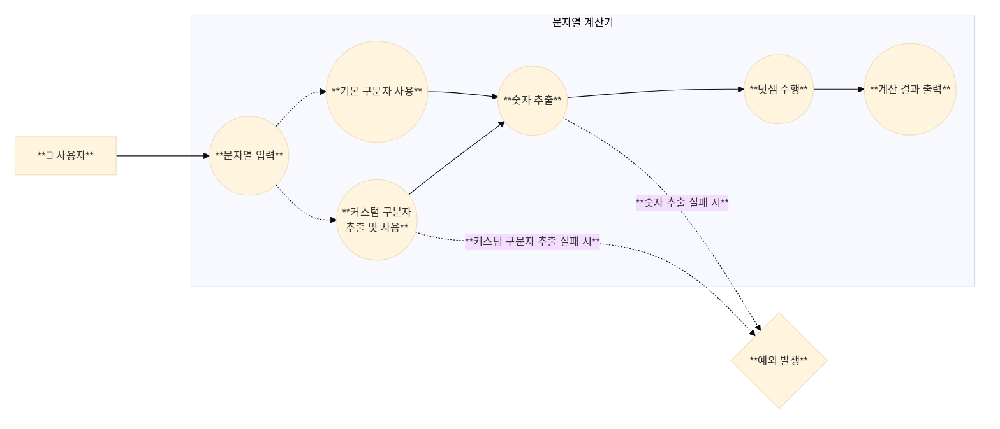

# 🧮 미션 - 문자열 덧셈 계산기

사용자가 입력한 문자열에서 **숫자를 추출하여 더하는 계산기**를 구현한다.   
다양한 구분자를 지원하며, 사용자 정의 구분자도 사용할 수 있다.  
 

## 🎯 사용자 Usecase

1. 사용자는 구분자와 양수로 구성된 문자열을 입력한다.
2. 사용자는 기본 구분자(쉼표, 콜론)를 사용하여 숫자를 구분할 수 있다.
3. 사용자는 커스텀 구분자를 정의하여 사용할 수 있다.
4. 사용자는 계산 결과를 확인한다.
5. 사용자는 잘못된 입력을 했을 때 예외를 받는다.  
    

## ✨ 기능 구현 목록

> [!NOTE]  
> 본 계산기는 사용자의 자유로운 사용을 최우선으로 고려하여 설계되었습니다.  
> 명시된 요구사항을 충실히 구현하면서도, 안정성과 정확성을 해치지 않는 선에서 불필요한 제약을 최소화했습니다.

### 1. 사용자 입력 처리

- 안내 문구 출력: `덧셈할 문자열을 입력해 주세요.\n`
- 사용자로부터 문자열 입력 받기
    - `Console.readLine()` 메서드 사용
    - 사용자 입력은 모두 stripe 처리

### 2. 문자열 파싱

- 입력 문자열에서 커스텀구분자 식별 및 추출 수행
    - 커스텀 구분자 확인 ("//"와 "\n" 사이의 문자)
        - 고려사항
            - 커스텀구분자는 숫자일 수 있음.
            - 커스텀구분자는 하나 이상의 문자열 길이를 가질 수 있음
            - 커스텀구분자는 기본 구분자와 같을 수 있음
            - 커스텀구분자는 여러개를 지정할 수 있음. 단, 모두 문자열 앞부분에 위치해야 함
            - 커스텀구분자는 공백이 될 수 있음. 또한, 공백이 여러개일 수 있음

        - 문자열 파싱에 실패하면 `IllegalArgumentException` 예외를 발생시키며 종료
            - 커스텀구분자의 길이가 0인 경우
            - 커스텀구분자가 문장의 제일 앞에 위치하지 않는 경우
            - 커스텀구분자에 `//`혹은 `\n`가 포함되는 경우 (커스텀구분자를 선언하기 위한 문자이므로 사용할 수 없음)

- 기본 구분자 (쉼표, 콜론) 및 커스텀 구분자(존재한다면)를 기준으로 문자열 분리
- 분리된 문자열을 숫자로 각각 변환
    - 분리된 문자열이 빈 문자열("") 인 경우에는 0으로 변환
    - 숫자 변환 시 변환에 실패하면 `IllegalArgumentException` 예외를 발생시키며 종료
        - 숫자가 아닌 문자가 들어가 있는 경우 (`NumberFormatException` Catch)
        - 변환된 숫자가 0인 경우
        - 변환된 숫자가 음수가 되는 경우
        - 변환된 숫자가 `long` 범위를 벗어나는 경우 (`NumberFormatException` Catch)
        - 변환된 숫자가 소수인 경우 (`NumberFormatException` Catch)

### 3. 덧셈 수행

- 파싱된 숫자들의 합계 계산

### 4. 결과 출력

- 계산된 결과를 형식에 맞춰 출력
    - 결과 출력: `결과 : [계산된 합계]`
        - ex) `결과 : 6`

