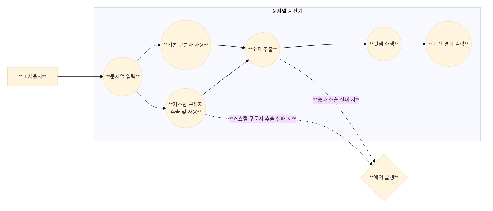
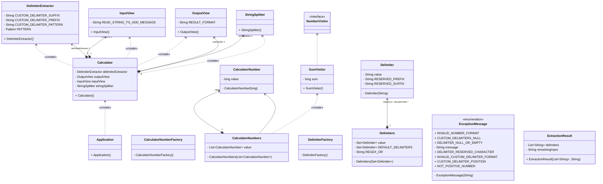

# 🧮 미션 - 문자열 덧셈 계산기

사용자가 입력한 문자열에서 **숫자를 추출하여 더하는 계산기**를 구현한다.   
다양한 구분자를 지원하며, 사용자 정의 구분자도 사용할 수 있다.  
 

## 🎯 사용자 Usecase

1. 사용자는 구분자와 양수로 구성된 문자열을 입력한다.
2. 사용자는 기본 구분자(쉼표, 콜론)를 사용하여 숫자를 구분할 수 있다.
3. 사용자는 커스텀 구분자를 정의하여 사용할 수 있다.
4. 사용자는 계산 결과를 확인한다.
5. 사용자는 잘못된 입력을 했을 때 예외를 받는다.  
    

## ✨ 기능 구현 목록

> [!NOTE]  
> 본 계산기는 사용자의 자유로운 사용을 최우선으로 고려하여 설계되었습니다.  
> 명시된 요구사항을 충실히 구현하면서도, 안정성과 정확성을 해치지 않는 선에서 불필요한 제약을 최소화했습니다.

### 1. 사용자 입력 처리

- 안내 문구 출력: `덧셈할 문자열을 입력해 주세요.\n`
- 사용자로부터 문자열 입력 받기
    - `Console.readLine()` 메서드 사용
    - 사용자 입력은 모두 stripe 처리

### 2. 문자열 파싱

- 입력 문자열에서 커스텀구분자 식별 및 추출 수행ß
    - 커스텀 구분자 확인 ("//"와 "\n" 사이의 문자)
        - 고려사항
            - 커스텀구분자는 숫자일 수 있음.
            - 커스텀구분자는 하나 이상의 문자열 길이를 가질 수 있음
            - 커스텀구분자는 기본 구분자와 같을 수 있음
            - 커스텀구분자는 여러개를 지정할 수 있음. 단, 모두 문자열 앞부분에 위치해야 함
            - 커스텀구분자는 공백이 될 수 있음. 또한, 공백이 여러개일 수 있음
            - 커스텀구분자가 다자릿수 숫자인 경우
                - 입력 문자열을 앞에서부터 순차적으로 파싱함
                - 구분자와 일치하는 부분은 분리점으로 처리하고, 나머지는 숫자로 인식
                - ex) `"//999\\n1999299993" → 구분자: "999", 결과: 1, 2, 93`

        - 문자열 파싱에 실패하면 `IllegalArgumentException` 예외를 발생시키며 종료
            - 커스텀구분자의 길이가 0인 경우
            - 커스텀구분자가 문장의 제일 앞에 위치하지 않는 경우
            - 커스텀구분자에 `//`혹은 `\n`가 포함되는 경우 (커스텀구분자를 선언하기 위한 문자이므로 사용할 수 없음)

- 기본 구분자 (쉼표, 콜론) 및 커스텀 구분자(존재한다면)를 기준으로 문자열 분리
- 분리된 문자열을 숫자로 각각 변환
    - 분리된 문자열이 빈 문자열("") 인 경우에는 0으로 변환
    - 숫자 변환 시 변환에 실패하면 `IllegalArgumentException` 예외를 발생시키며 종료
        - 숫자가 아닌 문자가 들어가 있는 경우 (`NumberFormatException` Catch)
        - 변환된 숫자가 0인 경우
        - 변환된 숫자가 음수가 되는 경우
        - 변환된 숫자가 `long` 범위를 벗어나는 경우 (`NumberFormatException` Catch)
        - 변환된 숫자가 소수인 경우 (`NumberFormatException` Catch)

### 3. 덧셈 수행

- 파싱된 숫자들의 합계 계산

### 4. 결과 출력

- 계산된 결과를 형식에 맞춰 출력
    - 결과 출력: `결과 : [계산된 합계]`
        - ex) `결과 : 6`

    
       

## ⚖️ 구현 내용

> 오른쪽의 <-> 버튼을 누르면 잘 보여요

### 1️⃣ 도메인 객체 설계

각 숫자는 `CalculatorNumber`라는 도메인 객체로 캡슐화되어 있으며, 이를 관리하는 일급 컬렉션인 `CalculatorNumbers`가 있습니다.
이렇게 개별 숫자를 도메인 객체로 분리한 이유는, 단순히 숫자를 다루는 것 이상의 의미를 부여하고, 이후 확장성을 고려한 설계입니다.
예를 들어, 향후 덧셈 외의 연산을 추가하거나, 숫자에 대한 검증 로직을 더할 때, 각 숫자 객체에 직접적인 책임을 부여할 수 있습니다.

여기서 `CalculatorNumbers`는 단순 리스트 이상의 역할을 합니다. 이 클래스는 **일급 컬렉션**으로, 숫자 리스트에 대한 연산을 캡슐화하여
외부에서 리스트를 직접 조작하지 못하게 하고, 모든 연산이 클래스 내부에서 처리되도록 합니다.
이를 통해 **응집도**를 높이고, **객체의 불변성**을 유지할 수 있었습니다.

    

### 2️⃣ 구분자 추출 및 문자열 파싱

입력 문자열에서 구분자를 추출하는 `DelimiterExtractor`는 사용자 정의 구분자를 추출하거나, 기본 구분자를 사용하는 기능을 제공합니다. 이 클래스는 커스텀 구분자의 존재 여부를 확인한 후, 구분자와
숫자를분리해주는 역할을 합니다.

**구분자를 추출하는 과정**은 매우 유연하게 설계하였습니다. 커스텀 구분자는 `//`로 시작하고 `\n`으로 끝나는 형식으로 제공되며, 이를 정규 표현식을 통해 처리합니다. 만약 형식이 올바르지 않다면
`IllegalArgumentException`을 발생시켜 사용자의 잘못된 입력을 방지합니다. 이 구조는 확장성 면에서도 큰 이점을 제공합니다. 앞으로 더 다양한 구분자 규칙이 추가되더라도
`DelimiterExtractor`를 통해 쉽게 확장할 수 있습니다.

    

### 3️⃣ Visitor 패턴 적용

숫자를 더하는 과정에서는 **Visitor 패턴**을 사용했습니다. 이 패턴은 숫자들의 모음(`CalculatorNumbers`)을 순회하며 덧셈을 수행하는 역할을 `SumVisitor`라는 객체에 위임합니다.
Visitor 패턴을 사용한 이유는, 계산의 로직과 데이터 구조를 분리함으로써, 숫자를 다루는 방식(덧셈, 곱셈 등)을 쉽게 확장할 수 있기 때문입니다.

이 **설계의 장점**은, 만약 덧셈 외에 곱셈과 같은 새로운 연산을 추가해야 할 때, `NumberVisitor`의 구현체를 추가하는 것만으로 간단히 확장할 수 있다는 것입니다. 또한, 데이터 구조(여기서는
`CalculatorNumbers`)는 변경되지 않고, 로직만을 추가하는 방식으로 **개방-폐쇄 원칙**(OCP)을 지킬 수 있었습니다.
