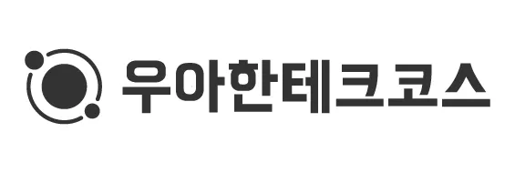

    

# 프리코스 1주차 미션 - 문자열 덧셈 계산기

---

[//]: # (![Generic badge]&#40;https://img.shields.io/badge/test-2_passed-blue.svg&#41;)

> 우아한테크코스 7기 1주차 미션, 문자열 덧셈 계산기를 구현한 저장소입니다.

 

## 요구사항

### 기능 요구사항

- 입력한 문자열에서 숫자를 추출하여 더하는 계산기를 구현한다.
- 기본 구분자는 `,` 와 `:` 이다.
- 커스텀 구분자를 지정하여 사용할 수 있다.

### 비기능 요구사항

- OOP 를 준수한다.
- setter 를 사용하지 않는다.
- DTO 를 사용한다.
- stream API를 사용한다.
- 기능 단위로 커밋한다.
- 단위 테스트를 작성한다.

### 입출력 요구사항

- `덧셈할 문자열을 입력해주세요. ` 가 콘솔에 출력된다
- 사용자로부터 `구분자와 양수로 구성된 문자열`을 입력받는다.
    - 잘못 입력된 경우 `IllegalArgumentException`을 발생시키고 애플리케이션을 종료시킨다.
    - 커스텀 구분자를 사용하기 위해선 문자열 앞부분에 `//` 와 `\n` 사이에 커스텀 구분자를 위치시켜야 한다.
    - 정상 입력된 경우 입력에 따른 결과를 판정한다
        - `결과 : 6` 과 같이 덧셈 결과를 표기한다.