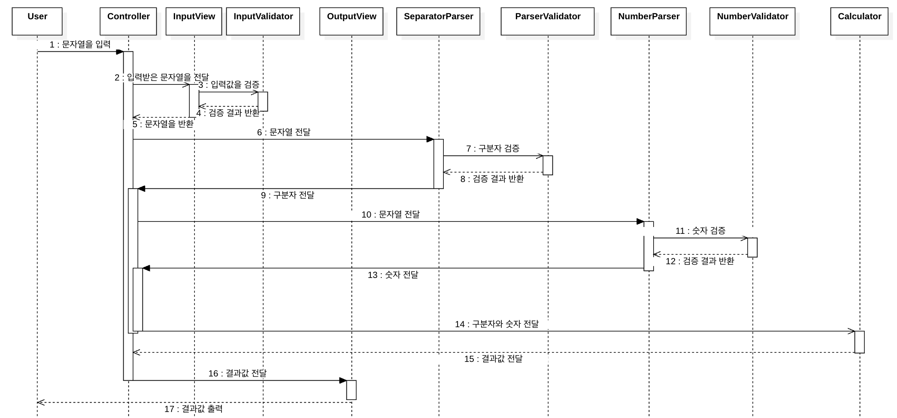

# java-calculator-precourse
## 구현할 기능 목록

---

#### 입력
- [x] 문자열을 입력한다.

#### 파싱 (분석 및 분해)
- [x] 커스텀 구분자가 있는지 확인한다.
  - [x] 구분자에 커스텀 구분자를 추가한다.
- [x] 구분자에 맞게 숫자를 구분한다.
  - [x] 커스텀 구분자와 기본 구분자 모두 사용하여 숫자를 구분한다.
  - [ ] 숫자가 있는지 확인한다. 없을 경우에는 0을 반환한다.

#### 계산
- [x] 구분한 숫자를 덧셈한다.

#### 출력 맟 종료
- [x] 반환한 숫자를 형식에 맞게 출력한다.
- [x] System.exit()를 호출하지 않고 종료한다.

#### 검증
- [ ] 입력 검증
  - [ ] 숫자가 양수인 확인한다.
  - [ ] 공백이 입력되었는지 확인한다.
  - [ ] 구분자 또는 양수인지 확인한다.
  - [ ] 커스텀 구분자를 형식에 맞게 입력했는지 확인한다.
  - [ ] 잘못된 입력이었을 경우에는 예외를 발생시킨다.

- [ ] 구분자 검증
  - [ ] 구분자가 문자인가 확인한다.
  - [ ] 구분자가 형식에 맞게 입력되었는지 확인한다.
  - [ ] 구분자가 숫자인지 확인한다.
  - [ ] 구분자가 중복되어 입력되었는지 확인한다.

- [ ] 숫자 검증
  - [ ] 숫자가 자료형의 범위를 넘는지 확인한다.
  - [ ] 숫자가 있는지 확인한다.


## 기본 요구 사항
-- -- --
### 기능 요구 사항
입력한 문자열에서 숫자를 추출하여 더하는 계산기를 구현한다.

- 쉼표(,) 또는 콜론(:)을 구분자로 가지는 문자열을 전달하는 경우 구분자를 기준으로 분리한 각 숫자의 합을 반환한다.
- 예: "" => 0, "1,2" => 3, "1,2,3" => 6, "1,2:3" => 6
- 앞의 기본 구분자(쉼표, 콜론) 외에 커스텀 구분자를 지정할 수 있다. 커스텀 구분자는 문자열 앞부분의 "//"와 "\n" 사이에 위치하는 문자를 커스텀 구분자로 사용한다.
- 예를 들어 "//;\n1;2;3"과 같이 값을 입력할 경우 커스텀 구분자는 세미콜론(;)이며, 결과 값은 6이 반환되어야 한다.
- 사용자가 잘못된 값을 입력할 경우 IllegalArgumentException을 발생시킨 후 애플리케이션은 종료되어야 한다.

### 입출력 요구 사항
#### 입력
- 구분자와 양수로 구성된 문자열

#### 출력
- 덧셈 결과

```
  결과 : 6
```

#### 실행 결과 예시
```
  덧셈할 문자열을 입력해 주세요.
  1,2:3
  결과 : 6
```

### 요구 사항 분석

#### 역할 (Actors)
사용자 (문자열을 입력하는 역할)
- 양수와 구분자로 이루어진 문자열을 입력한다.

시스템 (결과를 출력하는 역할)
- 문자열을 입력받는다.
- 문자열을 검증한다.
- 구분자를 통해 숫자를 구분한다.
- 구분한 숫자를 덧셈한다.
- 숫자를 덧셈하여 결과를 도출한다.
- 도출한 결과를 출력한다.

#### 이벤트 흐름 (Flow of events)
시나리오는 다음과 같다.
1. 문자열을 입력한다.
2. 시스템은 입력한 문자열을 검증한다.
3. 시스템은 문자열에 포함되어 있는 양수를 덧셈한다.
4. 시스템은 덧셈한 결과를 출력한다.

#### 예외 사항
시스템은 다음과 같은 예외사항을 확인한다.

- 구분자가 포함된 양수 문자열인가?
  - 공백이 입력되었는가?
  - 0 이상의 숫자인가?
  - 구분자 또는 양수가 아닌 문자가 포함되어있는가?
  - 공백이 포함된 문자열인가?
- 구분자가 포함되어 있는가?
  - 구분자 없이 숫자만 입력되었는가?
  - 커스텀 구분자가 문자열 "//"와 문자열 "\n" 사이에 위치하는가?
  - 구분자가 숫자인가? 
  - 기본 구분자가 또 입력되었는가? 
  - 커스텀 구분자가 중복되어 입력되었는가?
- 숫자가 int형 혹은 long형의 범위를 넘는가?
- 잘못된 입력값에 IllegalArgumentException을 발생시키는가?

#### 클래스 정의 및 시퀀스 다이어그램
사용자와 시스템(클래스)은 다음과 같은 시퀀스에 따라 동작한다.
- MVC 패턴 적용
- Validator 적용
- Model -> SeparatorParser, NumberParser, Calculator
  - SeparatorParser: 구분자를 파싱한다.
  - NumberParser: 숫자를 파싱한다.
  - Calculator: 숫자를 덧셈한다.
- View -> InputView, OutputView
  - InputView: 문자열을 입력받는다.
  - OutputView: 결과를 출력한다.
- Validator -> InputValidator, SeparatorValidator, NumberValidator
  - InputValidator: 입력값 검증
  - SeparatorValidator: 구분자 검증
  - NumberValidator: 숫자 검증
- Validator는 위에서 정의한 예외사항을 검증한다.


