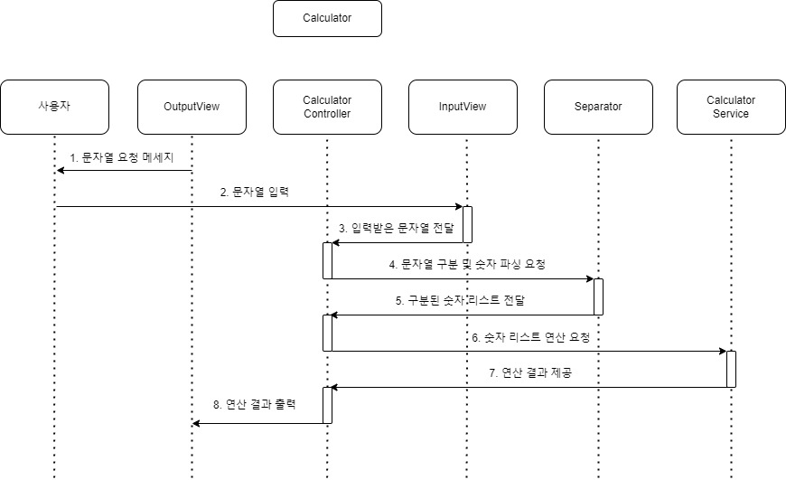

# java-calculator-precourse

## 구현 기능 목록
- [ ] 문자열 입력 받기
- [ ] 커스텀 구분자 parsing
- [ ] 적절한 형식인지 판단하기 (exception 발생)
- [ ] 문자열에서 연산의 대상 숫자 parsing
- [ ] 덧셈 연산
- [ ] 연산의 결과 출력하기

## 객체 목록과 각 객체 별 책임
- InputController
  - 시스템으로 들어오는 input을 담당한다.
- StringPlusCalculator
  - 입력으로 들어온 input에 대해서 작업(parsing, plus etc)을 해서 결과 값을 반환하는 게산기 객체다.
- InputParser
  - input string에 대해서 parsing 작업을 담당한다.
  - 커스텀 구분자 parsing
  - 연산의 대상 숫자 parsing
-  CheckForm
  - input에 대해서 적절한 입력인지 판단하고 exception 발생을 담당한다.
- Calculation
  - 대상 연산자들에 대해서 연산 수행을 담당한다.
- PrintOutput
  - 콘솔 창에 출력하는 일을 담당한다.
- InputString
  - input 문자열 자체의 정보를 가지고 있는 객체다. 구분자, 피연산자 필드도 포함한다. 

## 제출 전 체크리스트
- [ ] 기능 단위로 커밋했는가?
- [ ] 모든 테스트를 통과 했는가?
- [ ] jdk 21로 빌드 성공하는지 확인했는가?
- [ ] 커밋, 자바 코드 컨벤션을 지켰는가?
- [ ] 열 제한 120 이하인가?
- [ ] 각 객체가 하나의 책임만을 가지는가? 
- [ ] 코드에 주석을 다 제거했는가?
- [ ] 필요없는 import 라이브러리 지웠는가?
