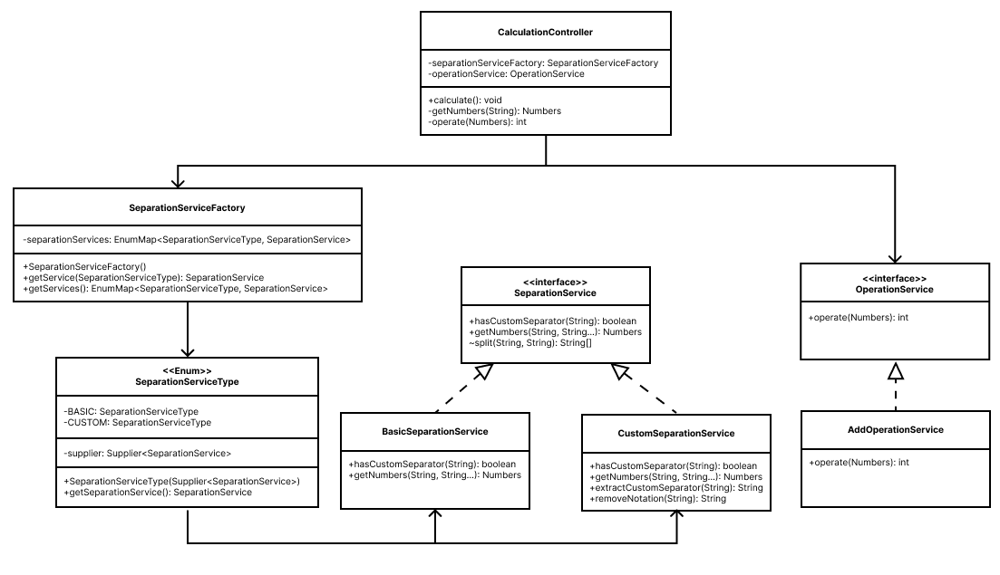
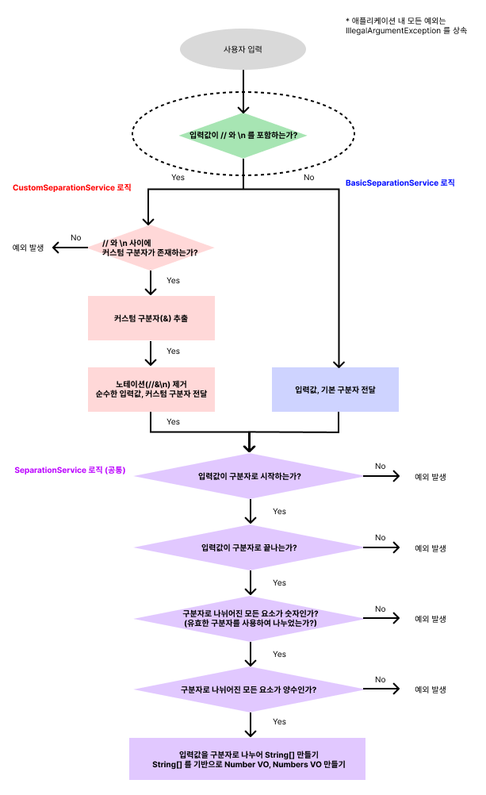

    

# 프리코스 1주차 미션 - 문자열 덧셈 계산기

---

> 우아한테크코스 7기 1주차 미션, 문자열 덧셈 계산기를 구현한 저장소입니다.

 
 

## 실행 예시

 
 

## 요구사항

### 기능 요구사항

- [x] 입력한 문자열에서 숫자를 추출하여 더하는 계산기를 구현한다.
- [x] 기본 구분자는 `,` 와 `:` 이다.
- [x] 커스텀 구분자를 지정하여 사용할 수 있다.
- [x] 입력값이 빈 문자열이거나 공백문자라면 합이 0 인 것으로 간주한다.

### 비기능 요구사항

- [x] OOP 를 준수한다.
- [x] setter 를 사용하지 않는다.
- [ ] DTO 를 사용한다.
- [x] stream API를 사용한다.
- [x] 기능 단위로 커밋한다.
- [x] 단위 테스트를 작성한다.

### 입출력 요구사항

- `덧셈할 문자열을 입력해주세요. ` 가 콘솔에 출력된다
- 사용자로부터 `구분자와 양수로 구성된 문자열`을 입력받는다.
    - 잘못 입력된 경우 `IllegalArgumentException`을 발생시키고 애플리케이션을 종료시킨다.
    - 커스텀 구분자를 사용하기 위해선 문자열 앞부분에 `//` 와 `\n` 사이에 커스텀 구분자를 위치시켜야 한다.
    - 정상 입력된 경우 입력에 따른 결과를 판정한다
        - `결과 : 6` 과 같이 덧셈 결과를 표기한다.

 
 

### 클래스 다이어그램

 
 

### 플로우차트

 
 

### 미션을 수행하며 기록한 블로그 포스팅

- <a href="https://velog.io/@chan7in/%EC%9A%B0%ED%85%8C%EC%BD%94-BE-7%EA%B8%B0-%ED%9A%8C%EA%B3%A0-1%EC%A3%BC%EC%B0%A8-%EA%B3%84%EC%82%B0%EA%B8%B0-indexOf-substring-%EC%9D%B4%EC%8A%A4%EC%BC%80%EC%9D%B4%ED%94%84-%EB%AC%B8%EC%9E%90">indexOf(), substring(), 이스케이프 문자 사용 시 주의할 점</a>
- <a href="https://velog.io/@chan7in/%EC%9A%B0%ED%85%8C%EC%BD%94-BE-7%EA%B8%B0-%ED%9A%8C%EA%B3%A0-PRE-1-%EA%B3%84%EC%82%B0%EA%B8%B0-%EC%A0%95%EA%B7%9C%ED%91%9C%ED%98%84%EC%8B%9D-%EA%B0%80%EB%B3%80%EC%9D%B8%EC%9E%90">정규표현식, 가변인자</a>
- <a href="https://velog.io/@chan7in/%EC%9A%B0%ED%85%8C%EC%BD%94-%ED%94%84%EB%A6%AC%EC%BD%94%EC%8A%A4-%ED%9A%8C%EA%B3%A0-1%EC%A3%BC%EC%B0%A8-Supplier">Supplier</a>

