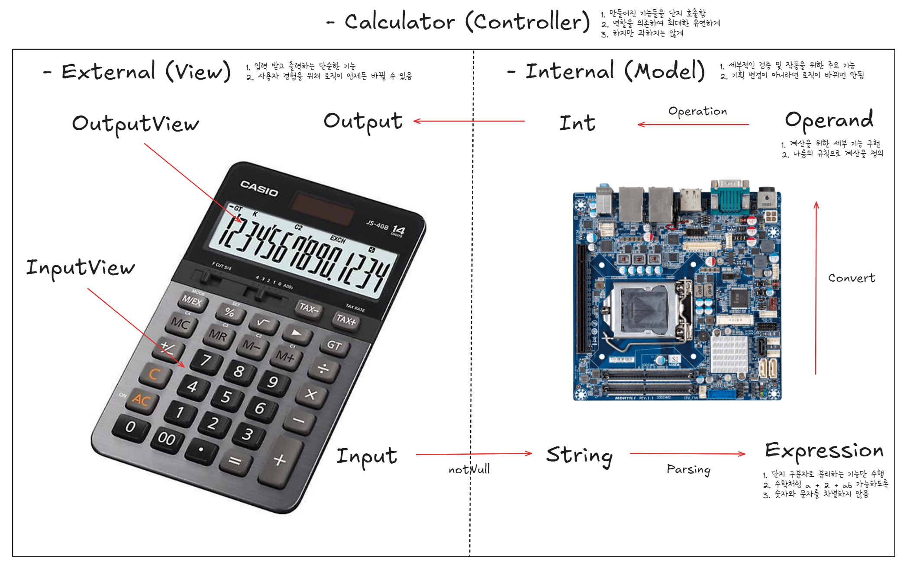

# 문자열 덧셈 계산기

## 구조도

## 기능 목록

### 1. 입력 처리

- **콘솔 입력 받기**: 멍청한 view를 위해 최소한의 책임 수행
    - [x] 안내 메시지를 출력한다.
    - [x] 사용자에게 문자열을 입력받는다.

- **입력 형식 검증**: 여러개의 view를 고려하여, 검증하는 책임 분리
    - [x] 입력이 null인 경우 `IllegalArgumentException`을 발생시킨다.

### 2. 문자열 추출

- **숫자 추출**
    - [x] 기본 구분자인 쉼표(`,`) 또는 콜론(`:`)을 사용하거나 커스텀 구분자를 사용하여 문자열에서 각 숫자를 추출하여 반환한다.
    - [x] 입력에서 적절한 값을 반환하지 못할 경우 `IllegalArgumentException`을 발생시킨다.

### 3. 덧셈 계산

- **숫자 합산**
    - [x] 반환된 숫자들을 더하여 총합을 계산한다.

### 4. 결과 출력

- **콘솔 결과 반환**: 멍청한 view를 위해 최소한의 책임 수행
    - [x] 출력 형식에 맞게 계산된 합계를 콘솔에 출력한다.
