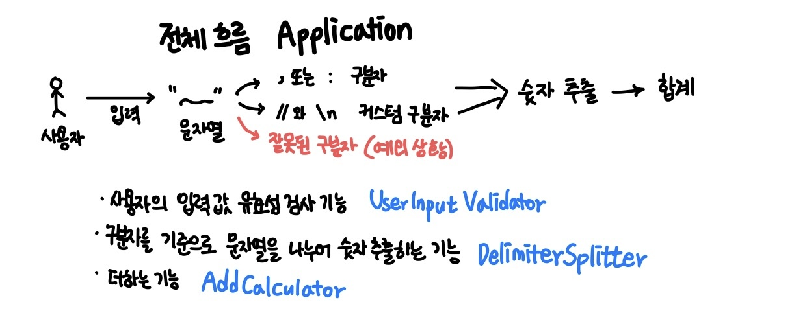

# 문자열 덧셈 계산기🧮

**구분자를 기준으로 분리한 후 각 숫자의 합을 구하는 기능**  
(즉 구분자를 잘 분리하는것이 관건이다.)    

### 기능 요구사항  
입력한 문자열에서 숫자를 추출하여 더하는 계산기를 구현한다.  

- 쉼표(,) 또는 콜론(:)을 구분자로 가지는 문자열을 전달하는 경우 구분자를 기준으로 분리한 각 숫자의 합을 반환한다.
- 기본 구분자(쉼표, 콜론) 외에 커스텀 구분자("//"와 "\n"사이에 위치한 문자)를 지정할 수 있다.
- 사용자가 잘못된 값을 입력할 경우 `IllegalArgumentException`을 발생시킨 후 애플리케이션은 종료되어야 한다.

### 기능 목록    

  

- 사용자가 입력한 값 유효성 검사 기능 (`UserInputValidator.class`)
  - 빈 문자열인 경우 : `0`을 반환
  - 잘못된 구분자 경우 : 기본 구분자(`,`, `:`) 또는 커스텀 구분자외의 구분자가 입력되면 예외처리
  - 숫자 외에 문자가 입력된 경우 : 예외처리
  - 음수인 경우 : 예외처리
 
- 구분자를 기준으로 문자열을 나누어 숫자 추출하는 기능 (`DelimiterSplitter`)
  - 기본 구분자(`,`, `:`) : `,`와 `:` 구분자를 기준으로 문자열을 나눈다
  - 커스텀 구분자 : 커스텀 구분자를 기준으로 문자열을 나눈다
  - 구분자를 기준으로 나눠 배열에 저장 후 값을 반환

- 더하는 기능 (`AddCalculator`)
  - 배열에 저장된 값들을 다 더한다
  - 더한 값을 반환

-------------------------------------
### 입출력 요구사항
입력  
- 구분자와 양수로 구성된 문자열

출력  
- 덧셈 결과  
```
결과 : 6
```

실행 결과 예시  
```
덧셈할 문자열을 입력해 주세요.
1,2:3
결과 : 6
```
