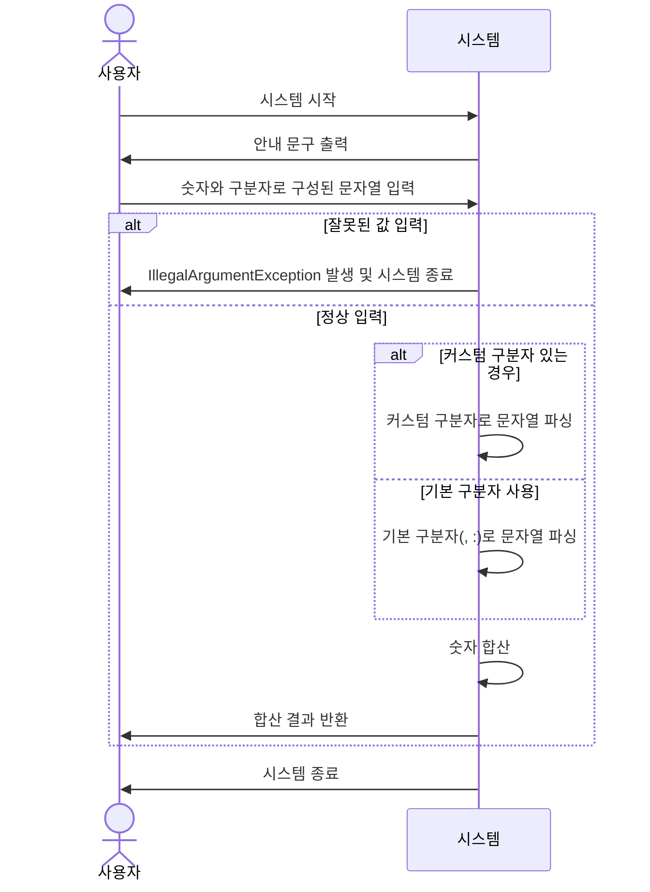

# java-calculator-precourse

## 구현 기능 목록
(3일차 20시 40분, 구현 시도는 4일차부터)

    1. 안내 문구를 출력한다.
    2. 문자열을 입력받는다.
      - 1,2 번 진행 중 아래에 테스트를 위한 설정들이 있음을 알았음
      - camp.nextstep.edu.missionutils.test.Assertions.assertSimpleTest;
      - 하지만 여전히 테스트 시작을 너무 큰 것으로 잡은 것 같음.
      - 다음엔 더 작은 테스트를 이용할 것
    3. 


  **InputHandler**

    - 안내 문구를 출력한다.
    - 문자열을 입력 받는다.
      - 입력 라이브러리가 별도로 지정됨
      - 공식 문서가 없어 동작 방식을 확인 해야함.

## A. 요구 사항 분석
### 1. 유스케이스 분석
- 유스케이스명: 입력된 문자열을 파싱해 더한다
- 액터 : 사용자
- 주요 성공 시나리오
    1. 사용자가 `시스템을 시작`하여 `시스템`이 `안내 문구`를 `출력`한다.
    2. 사용자가 "숫자와 `구분자`로 구성"된 `문자열`을 입력한다.
    3. 시스템은 `문자열을 파싱`하여 `숫자를 합`해 `사용자에게 반환`하고 `종료`한다.
- 확장
    - 2-a. 사용자가 `잘못된 값을 입력`하면 `IllegalArgumentException`와 함께 `종료`한다.
    - 2-b. 사용자는 문자열 앞에 "//;\\"와 같이 `커스텀 구분자`를 지정하여 문자열을 입력할 수 있다.
- 시퀀스 다이어그램(임시)



### 2. 도메인 분석
#### 역할
    - InputHandler : 문자열 입력기
    - Parser : 파서
    - Caculator : 계산기
    - CustomDelimiter : 커스텀 구분자
    - Delimiter : 구분자
    - InputValidator : 입력 값 검증기

#### 책임
    - 안내 문구를 출력한다.
    - 문자열을 입력 받는다.
      - 입력 라이브러리가 별도로 지정됨
      - 공식 문서가 없어 동작 방식을 확인 해야함.
    - 커스텀 구분자가 있는지 확인한다.
      - 있다면 구분자를 추출해 구분자로 추가한다.
      - 구분자 지정을 위한 부분을 삭제한다.
    - 입력 문자열을 검증한다.
      - 첫 문자가 "/", "숫자", ""(공백) 중 하나다.
        - 첫 문자는 어떻게 확인하나?
        - 입력 단계에서 검증할 사항은 이것 하나 인가?
        - 문자열 가장 앞에 다른 것이 오면?
    - 문자열에 구분자와 숫자만 있나?
    - 구분자 기준으로 문자열을 파싱한다.
      - 문자열에 구분자와 숫자만 있는지 확신할 수 있나?=>추가
      - 파싱된 숫자는 유효한가?
    - 파싱되어 반환된 숫자들을 더한다.
    - 결과를 출력한다.
    - 구분자를 관리한다.
    - 잘못된 입력이면 예외를 발생 시킨다.


#### 역할에 책임 할당, 각각의 책임에 의문인 점
    - InputHandler
      - 안내 문구를 출력한다.
      - 문자열을 입력 받는다.
        - 입력 라이브러리가 별도로 지정됨
        - 공식 문서가 없어 동작 방식을 확인 해야함.
    - InputValidator
      - 잘못된 입력이면 예외를 발생 시킨다.
      - 입력 문자열을 검증한다.
        - 첫 문자가 "/", "숫자", ""(공백) 중 하나다.
          - 첫 문자는 어떻게 확인하나?
          - 입력 단계에서 검증할 사항은 이것 하나 인가?
          - 문자열 가장 앞에 다른 것이 오면?
    -CustomDelimiter
      - 커스텀 구분자가 있는지 확인한다.
        - 있다면 구분자를 추출한다.
        - 구분자 지정을 위한 부분을 삭제한다.
      - 커스텀 구분자가 
    - Delimiter
      - 구분자를 관리한다.
    - Parser
      - 구분자 기준으로 문자열을 파싱한다.
        - 문자열에 구분자와 숫자만 있는지 확신할 수 있나?=>추가
        - 파싱된 숫자는 유효한가?
      - 잘못된 입력이면 예외를 발생 시킨다.
    - Calculator
      - 안내 문구를 출력한다.
      - 문자열을 입력 받는다.
        - 입력 라이브러리가 별도로 지정됨
        - 공식 문서가 없어 동작 방식을 확인 해야함.
      - 파싱되어 반환된 숫자들을 더한다.
      - 결과를 출력한다.
      


## B.요구 사항 요약(SD 문서와 동일)
### 과제 진행 요구 사항

* 미션 시작 : 미션 저장소 포크 및 클론
    * [문자열 덧셈 계산기](https://github.com/woowacourse-precourse/java-calculator-7)
* 구현 기능 목록 정리
    * 시점 : **기능 구현 전
    * 위치: `README.md`
* Git 커밋 단위: 상기의 기능 목록 단위 추가
    * [AngularJS Git Commit Message Conventions](https://gist.github.com/stephenparish/9941e89d80e2bc58a153)을 참고해 커밋 메시지를 작성한다.
* 자세한 방법은 프리코스 진행 가이드 문서를 참고

### 기능 요구 사항
목표: 입력한 문자열에서 숫자를 추출하여 더하는 계산기를 구현한다.
* "쉼표(,) or 콜론(:)"을 `구분자`로 가지는 `문자열`을 `전달`하는 경우 `구분자를 기준으로 분리한` 각 `숫자의 합`을 `반환`한다.
    * 예: "" => 0, "1,2" => 3, "1,2,3" => 6, "1,2:3" => 6
* `커스텀 구분자` 지정 가능(상기 기본 구분자 외)
    * 문자열 앞 "//" "\\n" 사이에 위치하는 문자
    * 예: "//;\\n1;2;3" => ; , 6 반환
* `사용자 입력 오류`(잘못된 입력)
    * `IllegalArgumentException` 발생, 애플리케이션 종료

#### 입출력 요구 사항

##### 입력
* 구분자와 양수로 구성된 문자열

##### 출력
* 덧셈 결과
    ```
    결과 : 6
    ```
##### 실행 결과 예시
```
덧셈할 문자열을 입력해 주세요.
1,2:3
결과 : 6
```

### 프로그래밍 요구 사항

* JDK 버전: 21
* 엔트리 포인트: `Application`의 `main()`
* `build.gradle` 변경 금지
    * **제공된 라이브러리 외 외부 라이브러리 사용 금지**
* 프로그램 종료 시 `System.exit()`를 호출 금지
* 파일, 패키지 등의 이름 변경, 이동 금지
    * 프로그래밍 요구 사항에 명시된 사항만 가능
* 자바 코드 컨벤션 준수
    * [Java Style Guide](https://github.com/woowacourse/woowacourse-docs/blob/main/styleguide/java)

### 라이브러리
* `Console` API 사용해 구현
    * `camp.nextstep.edu.missionutils`에서 제공
    * 사용자 입력:  `camp.nextstep.edu.missionutils.Console`의 `readLine()`
