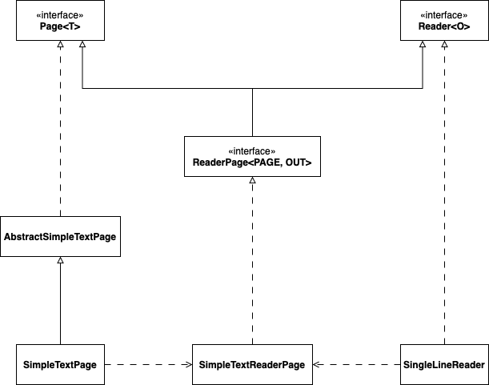
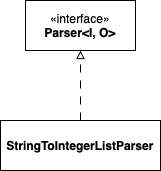
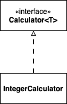

## 설계

> 이번 프리코스의 과제 애플리케이션의 설계는 최대한 객체지향적 설계를 지향하기 위해 
> SOLID 원칙을 공부하며 준수하기 위한 설계를 구성하고자 합니다.
> 간단한 애플리케이션이더라도 객체지향적 설계를 연습하여 설계 능력을 향상시키고자 합니다.

본 애플리케이션의 기능을 크게 콘솔에 텍스트를 입력/출력하는 기능과 사용자의 입력값을 요구사항에 맞게 파싱하는 기능, 
파싱된 모든 수를 합산하는 계산 기능으로 구분할 수 있고, 기능 별로 각각 Page, Parser, Calculator 인터페이스로
구분하여 단일 책임 원칙을 준수하고자 합니다.

---

### 1. Page 인터페이스
`Page` 인터페이스는 특정 Content를 콘솔에 출력하는 책임을 담당합니다. 본 애플리케이션에서는 간단한 텍스트만 출력하기 때문에 
해당 인터페이스를 `SimpleTextPage` 클래스로 구현하여 Content 값을 `System.out.print`합니다.

또한, `Reader` 인터페이스는 사용자로부터 콘솔에 입력받을 수 있는 책임을 담당합니다. 본 애플리케이션에서는 한 줄의 데이터만 입력받을 수 있기 때문에
해당 인터페이스를 `SingleLineReader` 클래스로 구현하여 사용자의 입력값을 받도록 합니다. 콘솔에 텍스트를 출력하고 입력받을 수 있는 페이지로 특화시킬 수 있도록
`ReaderPage` 인터페이스가 `Page` 인터페이스와 `Reader` 인터페이스를 상속하여 동시에 읽고 쓸 수 있는 책임을 담당합니다.

아래는 `Page` 모듈 클래스 다이어그램입니다.

### 2. Parser
`Parser` 인터페이스는 Input 값을 요구사항에 맞는 Output 값으로 파싱하는 책임을 담당합니다. 
본 애플리케이션에서는 `String` 값을 `List<Integer>` 값으로 파싱하는 기능을 요구하기 때문에 
`StringToIntegerListParser` 클래스로 구현하여 파싱하도록 합니다.

아래는 `Parser` 모듈 클래스 다이어그램입니다.

### 3. Calculator
`Calculator` 인터페이스는 인자로 받은 데이터를 계산하여 반환하는 책임을 담당합니다. 
본 애플리케이션에서는 `Integer` 타입에 대한 데이터들의 값을 계산하여 반환하기 위해 `IntegerCalculator` 클래스로 구현하여 계산하도록 합니다.

아래는 `Calculator` 모듈 클래스 다이어그램입니다.

